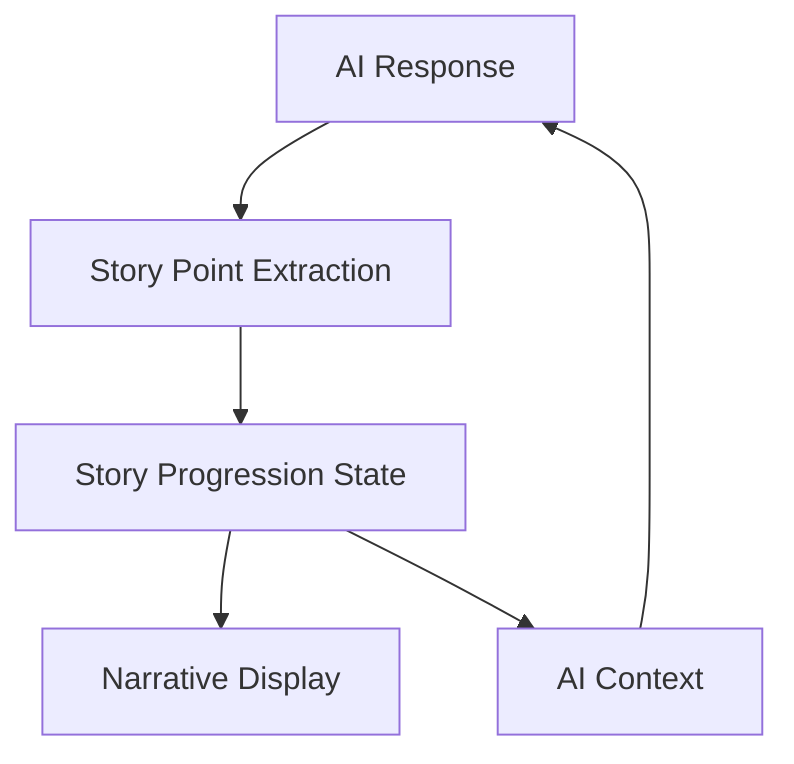

# Main Storyline Progression System Implementation Plan (MVP Focus)

## Overview

This document outlines the implementation plan for the Main Storyline Progression System (Issue #165). The system will enable the AI to generate a coherent linear narrative while tracking critical story moments, providing flexible guidance without rigid plot points.

## System Architecture



## Implementation Components

### 1. Core Data Types and Interfaces

These are already defined in `narrative.types.ts`:
- `StoryProgressionPoint` interface
- `StoryProgressionState` interface
- `StoryProgressionData` interface
- `StoryProgressionAction` types

### 2. Story Utility Functions (storyUtils.ts)

These are already implemented:
- `extractStoryPointFromNarrative`: Extracts story points from AI responses
- `createStoryProgressionPoint`: Creates story point objects
- `addStoryPoint`: Adds points to the progression state
- `generateStoryProgressionSummary`: Creates summaries for AI context
- `containsSignificantStoryAdvancement`: Detects important story moments
- `buildStoryPointPromptExtension`: Builds AI prompt extensions

### 3. Narrative Reducer Extensions

The narrative reducer already has handlers for story progression actions:
- `ADD_STORY_POINT`
- `UPDATE_CURRENT_POINT`
- `MARK_BRANCHING_POINT_TAKEN`
- `RESET_STORY_PROGRESSION`

### 4. useStoryProgression Hook

This hook is already implemented and provides:
- Access to story progression state
- Methods to process narratives for story points
- Functions to generate summaries for AI context

### 5. Game Service Integration

The game service has been updated to:
- Include story progression data in AI responses
- Add story point prompt extensions to AI prompts
- Process story progression data from AI responses

## MVP Implementation Plan

### Phase 1: Create useNarrativeProcessor Hook

This hook will process narrative text into segments and integrate with story progression:

```typescript
// Key functionality
function useNarrativeProcessor() {
  // State for processed segments
  const [processedSegments, setProcessedSegments] = useState<NarrativeSegment[]>([]);
  
  // Process narrative text into segments
  const processNarrative = (narrative: string) => {
    // Extract player actions, GM responses, item updates, and story points
  };
  
  // Add player action
  const addPlayerAction = (action: string) => {};
  
  // Add GM response
  const addGMResponse = (response: string) => {};
  
  // Add narrative segment
  const addNarrativeSegment = (segment: NarrativeSegment) => {};
  
  // Clear segments
  const clearSegments = () => {};
  
  return {
    processedSegments,
    addPlayerAction,
    addGMResponse,
    addNarrativeSegment,
    clearSegments
  };
}
```

### Phase 2: Update NarrativeDisplay Component

Enhance the NarrativeDisplay component to:
- Use the useNarrativeProcessor hook
- Highlight key story points
- Properly render all narrative segments

### Phase 3: Integrate with AI Response Processing

Ensure that:
- Story points are extracted from AI responses
- Story progression state is updated
- Story progression context is included in AI prompts

### Phase 4: Testing

Implement tests for:
- Story point extraction
- Narrative processing
- Story progression state management
- Component rendering

## Implementation Steps (Detailed)

### Step 1: Implement useNarrativeProcessor Hook

Create a new file `useNarrativeProcessor.ts` in the hooks directory:

```typescript
import { useState, useCallback } from 'react';
import { NarrativeSegment, UseNarrativeProcessorResult } from '../types/narrative.types';
import { useStoryProgression } from './useStoryProgression';

export function useNarrativeProcessor(): UseNarrativeProcessorResult {
  const [processedSegments, setProcessedSegments] = useState<NarrativeSegment[]>([]);
  const { processNarrativeForStoryPoints } = useStoryProgression();
  
  // Process narrative text into segments
  const processNarrative = useCallback((narrative: string) => {
    // Implementation details
  }, [processNarrativeForStoryPoints]);
  
  // Add player action
  const addPlayerAction = useCallback((action: string) => {
    // Implementation details
  }, []);
  
  // Add GM response
  const addGMResponse = useCallback((response: string) => {
    // Implementation details
  }, [processNarrativeForStoryPoints]);
  
  // Add narrative segment
  const addNarrativeSegment = useCallback((segment: NarrativeSegment) => {
    // Implementation details
  }, []);
  
  // Clear segments
  const clearSegments = useCallback(() => {
    setProcessedSegments([]);
  }, []);
  
  return {
    processedSegments,
    addPlayerAction,
    addGMResponse,
    addNarrativeSegment,
    clearSegments
  };
}
```

### Step 2: Update NarrativeContent Component

Enhance the NarrativeContent component to highlight story points:

```typescript
// Add to NarrativeContent.tsx
const StoryPointHighlight = ({ content, isKeyPoint }: { content: string, isKeyPoint: boolean }) => {
  if (!isKeyPoint) return <>{content}</>;
  
  return (
    <div className="story-point-highlight">
      <div className="story-point-marker">📌 Key Story Point</div>
      <div className="story-point-content">{content}</div>
    </div>
  );
};
```

### Step 3: Update AI Response Processing

Ensure the gameService properly processes story progression data:

```typescript
// In gameService.ts
// Process storyProgression field if it exists
let storyProgression: StoryProgressionData | undefined = undefined;

if (jsonResponse.storyProgression && typeof jsonResponse.storyProgression === 'object') {
  storyProgression = {
    currentPoint: jsonResponse.storyProgression.currentPoint,
    title: jsonResponse.storyProgression.title,
    description: jsonResponse.storyProgression.description,
    significance: jsonResponse.storyProgression.significance,
    characters: jsonResponse.storyProgression.characters,
    isMilestone: jsonResponse.storyProgression.isMilestone
  };
}
```

### Step 4: Add CSS for Story Point Highlighting

Add CSS styles for story point highlighting:

```css
/* In narrative.css */
.story-point-highlight {
  border-left: 4px solid #ffd700;
  padding-left: 1rem;
  margin: 1rem 0;
  background-color: rgba(255, 215, 0, 0.1);
}

.story-point-marker {
  font-weight: bold;
  color: #b8860b;
  margin-bottom: 0.5rem;
}

.story-point-content {
  font-style: italic;
}
```

## Testing Strategy

1. **Unit Tests**: Test individual functions in storyUtils.ts
2. **Hook Tests**: Test useNarrativeProcessor and useStoryProgression hooks
3. **Component Tests**: Test NarrativeDisplay and NarrativeContent components
4. **Integration Tests**: Test the full story progression flow

## Success Criteria

The implementation will be considered successful when:

1. Story points can be extracted from AI responses
2. Progression through the narrative is trackable
3. Key story moments are highlighted in the UI
4. The AI can reference past story points for context
5. Story progression state is accessible via the useStoryProgression hook
6. All tests pass

## MVP Scope Limitations

To maintain an MVP focus, we will:

1. Focus on linear story progression (defer branching for future)
2. Implement basic highlighting of key story points (defer advanced visualization)
3. Keep the AI prompt extensions simple and focused
4. Prioritize core functionality over advanced features

## Future Enhancements

After the MVP is complete, potential enhancements include:

1. Story branching based on player decisions
2. Visual representation of story progression (timeline, graph)
3. Save/load functionality for story progression state
4. Integration with the journal system for story recap
5. Advanced story point visualization and filtering