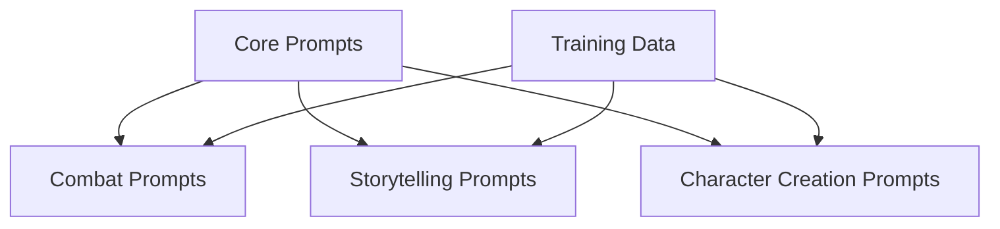

# AI Systems Overview

This Map of Content (MOC) provides a comprehensive overview of AI integration, prompt engineering, and training data in BootHillGM.

## Core AI Components
- [[game-master-logic|Game Master Logic]] - Core AI decision making
- [[gemini-integration|Gemini Integration]] - Gemini 1.5 Pro implementation
- [[../reference/gemini-api-guide|API Reference]] - Gemini API documentation

## Prompt Engineering
### Game Systems
- [[prompt-engineering/combat|Combat Prompts]] - Combat system prompts
- [[prompt-engineering/storytelling|Storytelling Prompts]] - Narrative generation
- [[prompt-engineering/character-creation|Character Creation Prompts]] - Character generation
- [[prompt-engineering/core-prompts|Core Prompts]] - Base system prompts

### System Relationships

## Training Data
- [[training-data/boot-hill-v2-rules|Boot Hill v2 Rules]] - Core game rules
- [[training-data/western-themes|Western Themes]] - Genre-specific content

## Implementation Status
| Component | Status | Integration |
|-----------|---------|-------------|
| Game Master Logic | Active | Core System |
| Gemini Integration | Active | API |
| Combat Prompts | Active | Combat System |
| Storytelling Prompts | Active | Narrative |
| Character Creation | Active | Creation System |

## Integration Points
### Core Systems
- [[../core-systems/ai-integration|AI Integration]]
- [[../core-systems/combat-system|Combat System]]
- [[../core-systems/journal-system|Journal System]]

### Features
- [[../features/_current/narrative-formatting|Narrative Formatting]]
- [[../features/_completed/storytelling|Storytelling]]
- [[../features/_completed/character-creation|Character Creation]]

## Technical Details
- [[../architecture/api-integration|API Integration]]
- [[../technical-guides/deployment|Deployment Guide]]
- [[../development/test-strategy|Test Strategy]]

## Performance Monitoring
- Response Time Tracking
- Token Usage Optimization
- Error Rate Monitoring
- Content Quality Metrics

## Development Guidelines
- Prompt Engineering Best Practices
- API Usage Guidelines
- Content Safety Parameters
- Error Handling Protocols

## Related Documentation
- [[../meta/project-overview|Project Overview]]
- [[../planning/roadmap|Development Roadmap]]