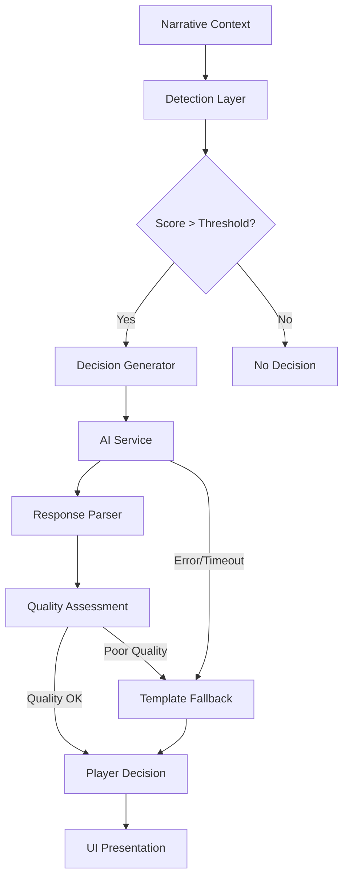

# AI-Driven Contextual Decision System

## Overview

The AI-Driven Contextual Decision System replaces the previous keyword-based approach with a sophisticated contextual analysis that presents meaningful choices to the player when narratively appropriate. The system analyzes game state, narrative context, and player character information to create immersive decision points that enhance the storytelling experience.

Think of it as a "narrative hooks" system similar to Drupal's hooks system, but powered by AI to automatically identify when and how to present decisions based on narrative context.

Rather than relying on predefined keywords to trigger decisions, the system analyzes narrative flow, character traits, dialogue patterns, and game state to determine when and what decisions to present to the player. This creates a more immersive and natural gameplay experience where decisions feel appropriate to the story context.

## Core Functionality

- **Contextual Detection**: Analyzes narrative text to identify natural decision points
- **Relevance Scoring**: Calculates decision appropriateness based on multiple factors
- **Multiple Generation Modes**: Template-based, AI-generated, or hybrid options
- **Fallback Mechanisms**: Graceful degradation when AI services are unavailable
- **DevTools Integration**: Testing and visualization of decision detection
- **Quality Assessment**: Evaluates decisions for completeness, diversity, and relevance

## Architecture

The system follows a layered architecture that integrates with existing game systems:



### Core Components

1. **AI Service Client** (`/app/services/ai/aiService.ts`)
   - Handles communication with the AI provider (Gemini)
   - Manages API authentication, rate limiting, and error handling
   - Processes and formats responses

2. **Contextual Decision Service** (`/app/services/ai/contextualDecisionService.ts`)
   - Detects appropriate moments for decisions
   - Generates contextually-relevant decision content
   - Evaluates quality of generated decisions

3. **Decision Quality Assessment** (`/app/utils/decisionQualityAssessment.ts`)
   - Evaluates decisions based on completeness, diversity, and relevance
   - Provides feedback for improvement
   - Ensures decisions meet quality thresholds

4. **Decision Feedback System** (`/app/utils/decisionFeedbackSystem.ts`)
   - Tracks player responses to improve future decisions
   - Records common issues and patterns
   - Enhances prompts based on feedback

5. **Enhanced Decision Generator** (`/app/utils/contextualDecisionGenerator.enhanced.ts`)
   - Provides the main API for generating decisions
   - Maintains multiple generation modes (template, AI, hybrid)
   - Handles fallbacks and caching

### Supporting Components

1. **Response Parser** (`/app/services/ai/responseParser.ts`)
   - Processes and validates AI responses
   - Extracts structured data from text responses
   - Handles various response formats gracefully

2. **PlayerDecisionCard** (`/app/components/player/PlayerDecisionCard.tsx`)
   - Displays decisions to the player
   - Handles user interactions
   - Provides visual feedback on choice impact

3. **Initialize System** (`/app/utils/initializeAIDecisionSystem.ts`)
   - Bootstraps the AI Decision System components
   - Sets up debug namespace
   - Connects services together

## Generation Process

The decision generation follows this process:

1. **Detection**: The system analyzes narrative context to determine if a decision should be presented (scores above threshold)
2. **Prompt Construction**: A prompt is built using narrative context, character traits, game state, and historical decisions
3. **AI Generation**: The prompt is sent to the AI model which generates decision content
4. **Quality Assessment**: The generated decision is evaluated for quality
5. **Presentation**: If quality meets threshold, the decision is presented to the player; otherwise, it falls back to template-based generation
6. **Feedback**: Player responses are recorded to improve future generations

## Decision Generation Modes

The system supports three operation modes, allowing for flexibility and graceful degradation:

### Template Mode
- Uses only pre-defined decision templates
- No AI integration
- Fastest performance
- Limited contextual awareness
- Recommended for: Development, offline play, predictable testing

### AI-Only Mode
- Uses only AI-generated decisions
- Highest contextual relevance
- Requires network connectivity
- May have higher latency
- Recommended for: Production with reliable connectivity, diverse narrative scenarios

### Hybrid Mode (Default)
- Attempts AI generation first
- Falls back to templates when needed
- Best balance of context and reliability
- Transparent to the player
- Recommended for: Standard gameplay, combining quality and reliability

Switch modes using `setDecisionGenerationMode('mode')` or via the DevTools interface.

## Decision Scoring Algorithm

The system uses a sophisticated scoring algorithm to determine when a decision should be presented, based on:

### Narrative Context Analysis
- **Dialogue Detection**: Higher scores for dialogue-heavy content (presence of quotation marks, dialogue markers)
- **Action Sequences**: Lower scores during action scenes (detection of words like "shot", "punch", "fight")
- **Story Point Type**: Higher scores for explicit decision points in the narrative

### Game State Factors
- **Location Changes**: Higher scores when entering new locations
- **Combat State**: Lower scores during active combat
- **Time Pacing**: Score gradually increases with time since the last decision

The scoring algorithm returns a value from 0 to 1, where higher values indicate a more appropriate moment to present a decision. The default threshold is 0.65.

## Integration Points

### For Game Developers

The main integration points for gameplay development are:

1. `generateEnhancedDecision(gameState, narrativeContext, locationType, forceGeneration)` - Primary function to generate decisions

2. `setDecisionGenerationMode(mode)` - Set generation mode ('template', 'ai', or 'hybrid')

3. Narrative Context Hook:
   ```jsx
   const { 
     recordPlayerDecision,
     currentDecision,
     hasActiveDecision
   } = useNarrativeContext();
   ```

### For AI Engineers

If you need to tune the AI component:

1. `contextualDecisionService.ts` - Adjust detection thresholds and prompt construction
2. `decisionQualityAssessment.ts` - Modify quality metrics and scoring weights
3. `decisionFeedbackSystem.ts` - Enhance feedback collection and prompt improvement

## Configuration

The decision system can be configured through the `ContextualDecisionServiceConfig` interface:

- `minDecisionInterval`: Minimum time between automatic decisions (ms)
- `relevanceThreshold`: Score threshold for presenting decisions (0-1)
- `maxOptionsPerDecision`: Maximum number of options per decision
- `useFeedbackSystem`: Whether to use the feedback system

Apply configuration when initializing the service:

```javascript
const config = {
  minDecisionInterval: 60000, // 1 minute minimum
  relevanceThreshold: 0.75,    // Higher threshold for decision presentation
  maxOptionsPerDecision: 3,    // Limit to 3 options
  useFeedbackSystem: true      // Use feedback system
};

const service = getContextualDecisionService(config);
```

The system requires the following environment variables:

```
AI_SERVICE_API_KEY=your_api_key_here
AI_SERVICE_ENDPOINT=https://api.example.com/v1/completions
AI_SERVICE_MODEL=gpt-4 # optional, defaults to 'gpt-4'
```

## Developer Tools

The system includes several tools for debugging and development:

1. **DevTools Panel**: Accessible via the gear icon in the game UI
   - Control decision generation mode
   - Manually trigger decisions
   - View detection scores

2. **Browser Console API**:
   ```javascript
   // Generate a decision
   window.bhgmDebug.decisions.generateDecision(window.gameState)
   
   // Set generation mode
   window.bhgmDebug.decisions.setMode('ai')
   
   // Evaluate decision quality
   window.bhgmDebug.quality.evaluateLastDecision()
   ```

3. **Decision Quality Testing**:
   ```bash
   # Run tests for decision quality assessment
   npm test -- utils/decisionQualityAssessment
   ```

### UI Controls
- **Generation Mode Toggle**: Switch between Template, AI-Only, and Hybrid modes
- **Force Generation Button**: Manually trigger a decision regardless of detection score
- **Detection Score Visualization**: Visual indicator of the current score

## Prompt Structure

The AI prompt structure is similar to Drupal's twig templates, with distinct sections for:

1. System instruction
2. Narrative context
3. Character information
4. Location data
5. Previous decisions
6. Response format guidelines

This provides a consistent framework that the AI model can use to generate contextually appropriate decisions.

## Error Handling

The system includes comprehensive error handling:

1. API connectivity issues trigger template fallbacks
2. Parsing errors are caught and logged
3. Low-quality generations fall back to templates
4. Client-side errors display user-friendly messages

## Integration with Game Systems

### Narrative System

The decision system integrates with the narrative system through:

- Detecting decision points in ongoing narrative
- Analyzing dialogue and story progression
- Presenting contextually relevant choices

### Character System

Character traits and history influence decision generation:

- Character personality traits affect decision options
- Previous choices influence future decision presentation
- Character relationships impact decision context

### Combat System

Combat state affects decision presentation:

- Fewer decisions during active combat
- Combat-specific decisions when appropriate
- Post-combat decisions with higher priority

## Performance Optimization

The decision system includes several performance optimizations:

1. **Memoized Components**: `PlayerDecisionCard` uses `React.memo()` to prevent unnecessary re-renders
2. **Lazy Generation**: Decision content is generated asynchronously to avoid blocking the UI
3. **Template Fallbacks**: Fast, synchronous fallbacks when AI generation is slow or fails
4. **Detection Threshold**: Avoids generating decisions when narrative context isn't suitable

## Troubleshooting

Common issues and solutions:

1. **Decision not appearing**: Check the detection score in DevTools; if consistently low, adjust detection thresholds
2. **Low-quality decisions**: Review quality assessment suggestions in console; adjust prompt if needed
3. **Slow generation**: Verify API connectivity; consider temporary template mode
4. **API errors**: Check API key configuration in `.env` file

## Implementation Status

| Component | Status | Notes |
|-----------|--------|-------|
| Detection Algorithm | Complete | Contextual analysis working |
| AI Integration | Complete | Using Gemini API |
| Template Fallback | Complete | Works offline |
| DevTools | Complete | Testing and visualization |
| Documentation | Complete | You're reading it! |
| Quality Assessment | Complete | Evaluates completeness, diversity, and relevance |
| Performance Optimization | Complete | Memoized components and lazy loading |

## Future Improvements

Planned improvements include:

1. Better narrative integration with player choices
2. Enhanced quality assessment using more sophisticated metrics
3. Expanded feedback system with reinforcement learning
4. More diverse decision templates for fallbacks
5. Integration with other narrative systems like dialogue
6. Enhanced detection of narrative themes
7. Character relationship-based decision weighting
8. Analytics for decision quality assessment
9. Personalization based on player history

## Testing

### Manual Testing

To test the system:

1. Open the DevTools panel in the game UI
2. Navigate to the AI Decision System section
3. Toggle between different generation modes
4. Use the "Generate AI Decision" button to force a decision
5. Monitor the detection score visualization

### Automated Testing

- Unit tests for decision scoring algorithm
- Integration tests for fallback mechanisms
- End-to-end tests for decision presentation

## Related Components

- [[game-master-logic|Game Master Logic]]
- [[context-management|Context Management]]
- [[../core-systems/narrative-system|Narrative System]]
- [[../features/_current/player-choice|Player Choice System]]

## Related Issue

- [GitHub Issue #200](https://github.com/jerseycheese/BootHillGM/issues/200)
