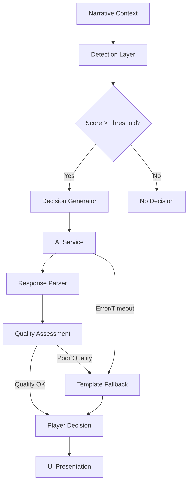

# AI-Driven Contextual Decision System

## Overview

The AI-Driven Contextual Decision System replaces the previous keyword-based approach with a sophisticated contextual analysis that presents meaningful choices to the player when narratively appropriate. The system analyzes game state, narrative context, and player character information to create immersive decision points that enhance the storytelling experience.

Think of it as a "narrative hooks" system powered by AI to automatically identify when and how to present decisions based on narrative context.

Rather than relying on predefined keywords to trigger decisions, the system analyzes narrative flow, character traits, dialogue patterns, and game state to determine when and what decisions to present to the player. This creates a more immersive and natural gameplay experience where decisions feel appropriate to the story context.

## Core Functionality

- **Contextual Detection**: Analyzes narrative text to identify natural decision points
- **Relevance Scoring**: Calculates decision appropriateness based on multiple factors
- **Multiple Generation Modes**: Template-based, AI-generated, or hybrid options
- **Fallback Mechanisms**: Graceful degradation when AI services are unavailable
- **DevTools Integration**: Testing and visualization of decision detection
- **Quality Assessment**: Evaluates decisions for completeness, diversity, and relevance

## Architecture

The system follows a modular architecture that integrates with existing game systems:



### Core Components

1. **AI Decision Service** (`/app/services/ai/aiDecisionService.ts`)
   - Main service orchestrating the decision generation process
   - Detects appropriate moments for decisions
   - Delegates to specialized modules for specific functionality

2. **Decision Detector** (`/app/services/ai/utils/aiDecisionDetector.ts`)
   - Contains logic to determine when a decision point should be presented
   - Calculates relevance scores based on narrative context
   - Uses multiple factors to determine appropriate moments

3. **Decision Generator** (`/app/services/ai/utils/aiDecisionGenerator.ts`)
   - Builds prompts for AI services
   - Converts AI responses to player decisions
   - Provides fallback decision generation

4. **AI Service Client** (`/app/services/ai/clients/aiServiceClient.ts`)
   - Handles communication with external AI services
   - Manages errors, retries, and rate limiting
   - Processes and formats responses

5. **Types and Constants** (`/app/services/ai/types/aiDecisionTypes.ts`, `/app/services/ai/utils/aiDecisionConstants.ts`)
   - Provides type definitions and constants used throughout the system
   - Ensures consistency and type safety

### Integration with Game Systems

The decision system integrates with other game systems through:

- **Narrative System**: Analyzing ongoing narrative to detect decision points
- **Character System**: Using character traits to influence decision options
- **Game State**: Evaluating the current game situation for decision relevance
- **Player History**: Tracking past decisions to inform future ones

## Detection Process

The decision detection process follows these steps:

1. **Context Analysis**: The system analyzes the current narrative state
2. **Scoring Calculation**: Multiple factors contribute to a decision score (0-1)
3. **Threshold Comparison**: The score is compared to the relevance threshold
4. **Decision Presentation**: If the score exceeds the threshold, a decision is presented

### Decision Scoring Factors

The scoring algorithm considers these key factors:

- **Dialogue Detection**: Higher scores for dialogue-heavy content
- **Action Sequences**: Lower scores during action scenes
- **Decision Points**: Higher scores for explicit decision moments
- **Location Changes**: Higher scores when entering new locations
- **Game State**: Lower scores during combat or active events
- **Time Pacing**: Gradual increase in score since last decision

## Decision Generation Process

When a decision point is detected, the system:

1. **Builds a Prompt**: Creates a detailed prompt using narrative context, character information, and game state
2. **Calls AI Service**: Sends the prompt to an external AI service
3. **Processes Response**: Converts the AI response into a player decision
4. **Handles Failures**: Uses fallback mechanisms when AI generation fails
5. **Presents Decision**: Displays the decision to the player through the UI

## Fallback Mechanisms

The system includes robust fallback mechanisms:

1. **Template-Based Decisions**: Pre-defined decision templates when AI is unavailable
2. **Local Generation**: Fallback to client-side generation for basic decisions
3. **Error Recovery**: Graceful handling of API errors with user-friendly messages

## Configuration

The decision system can be configured through the `AIDecisionServiceConfig` interface:

- `minDecisionInterval`: Minimum time between decisions (ms)
- `relevanceThreshold`: Score threshold for presenting decisions (0-1)
- `maxOptionsPerDecision`: Maximum number of options per decision
- `apiConfig`: Configuration for the external AI service

Example configuration:

```typescript
const config = {
  minDecisionInterval: 30000, // 30 seconds minimum
  relevanceThreshold: 0.65,   // Default threshold
  maxOptionsPerDecision: 4,   // Maximum 4 options
  apiConfig: {
    apiKey: process.env.AI_SERVICE_API_KEY,
    endpoint: process.env.AI_SERVICE_ENDPOINT,
    modelName: 'gpt-4',
    maxRetries: 3,
    timeout: 15000,
    rateLimit: 10
  }
};
```

## API Usage

### Main Service API

```typescript
// Create an instance of the service
const aiDecisionService = new AIDecisionService(config);

// Detect if a decision should be presented
const detectionResult = aiDecisionService.detectDecisionPoint(
  narrativeState,
  character,
  gameState
);

// Generate a decision if appropriate
if (detectionResult.shouldPresent) {
  const decision = await aiDecisionService.generateDecision(
    narrativeState,
    character,
    gameState
  );
  
  // Present the decision to the player...
  
  // Record the player's choice
  aiDecisionService.recordDecision(
    decision.id,
    selectedOptionId,
    resultingOutcome
  );
}
```

## Testing and Development

The system includes comprehensive test coverage:

- Unit tests for individual components
- Integration tests for the complete decision flow
- Mock tests for API interactions

Development tools include:

1. **Console Logging**: Detailed logging for decision detection and generation
2. **Decision Testing UI**: Visualization of decision scores and thresholds
3. **Manual Generation**: Force decision generation for testing purposes

## Performance Considerations

The decision system is designed for optimal performance:

- **Async Operations**: Non-blocking API calls
- **Throttling**: Minimum interval between decisions
- **Caching**: Memorization of expensive calculations
- **Fallbacks**: Fast local generation when needed

## Future Improvements

Planned improvements include:

1. Better integration with character personality traits
2. Enhanced narrative analysis for more contextual decisions
3. Expanded decision templates for fallback scenarios
4. Multi-stage decisions with branching outcomes
5. Analytics for decision quality and player satisfaction

## Related Components

- [[../core-systems/player-decision-system|Player Decision System]]
- [[../core-systems/narrative-system|Narrative System]]
- [[../features/_current/player-choice|Player Choice System]]

## Related Issue

- [GitHub Issue #200](https://github.com/jerseycheese/BootHillGM/issues/200)
