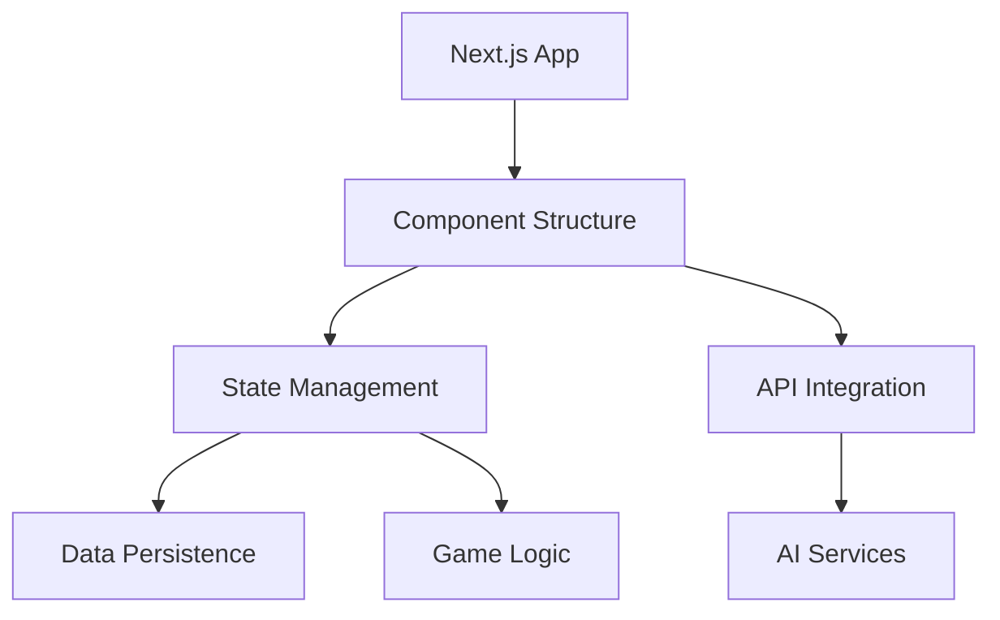

# Architecture Overview

This Map of Content (MOC) provides a comprehensive overview of BootHillGM's technical architecture and implementation details.

## Core Architecture
- [[./architecture-decisions|Architecture Decisions]] - Key technical decisions and rationales
- [[./next-js-setup|Next.js Setup]] - Framework configuration and setup
- [[./component-structure|Component Structure]] - UI component organization

## System Design
### State Management
- [[state-management|State Management]] - Global state architecture
- [[data-persistence|Data Persistence]] - Data storage and retrieval
- Related: [[../core-systems/state-management|Core State Management]]

### Integration
- [[api-integration|API Integration]] - External API implementation
- Related: [[../reference/gemini-api-guide|Gemini API Guide]]

## Technical Architecture

## Implementation Status
| Component | Status | Technology |
|-----------|---------|------------|
| Next.js Setup | Complete | Next.js 14 |
| State Management | Active | Context + Reducer |
| Data Persistence | Active | LocalStorage |
| API Integration | Active | Gemini API |

## Key Technologies
### Frontend
- Next.js 14
- React Context
- Tailwind CSS
- TypeScript

### State Management
- React Context
- useReducer
- LocalStorage
- State Protection

### Testing
- Jest
- React Testing Library
- Integration Tests
- E2E Testing

## Development Guidelines
### Code Organization
- Component Structure
- State Management Patterns
- API Integration Patterns
- Testing Strategies

### Best Practices
- State Management
- Component Design
- Error Handling
- Performance Optimization

## Related Documentation
### Technical Guides
- [[../technical-guides/setup|Development Setup]]
- [[../technical-guides/deployment|Deployment Guide]]
- [[../technical-guides/testing|Testing Guide]]
- [[../technical-guides/contributing|Contributing Guide]]

### Planning
- [[../planning/roadmap|Development Roadmap]]

### Core Systems
- [[../core-systems/combat-system|Combat System]]
- [[../core-systems/ai-integration|AI Integration]]
