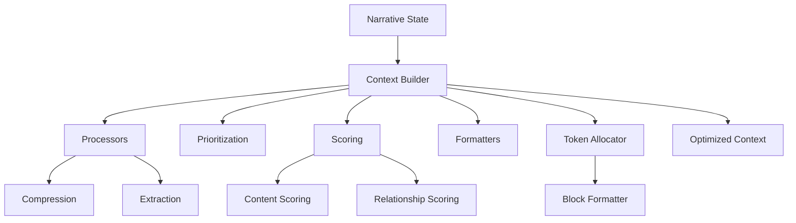

# Narrative Context Builder Refactoring

## Overview

The Narrative Context Builder system has been refactored into a modular architecture to improve maintainability, testability, and readability while maintaining exact functionality. The system now consists of specialized components that work together to create optimized AI context.

## Architectural Changes

The monolithic implementation was decomposed into specialized modules:



## File Structure

The refactored system is organized into the following files:

| File | Purpose | Line Count |
|------|---------|------------|
| `narrativeContextBuilder.ts` | Main context building orchestrator | ~150 lines |
| `narrativeContextDefaults.ts` | Default configuration values | ~70 lines |
| `narrativeContextProcessors.ts` | Compression and extraction utilities | ~130 lines |
| `narrativeContextPrioritization.ts` | Element prioritization logic | ~70 lines |
| `narrativeContextFormatters.ts` | Text formatting utilities | ~100 lines |
| `narrativeContextScoring.ts` | Relevance scoring algorithms | ~100 lines |
| `narrativeContextTokens.ts` | Token allocation and budget management | ~180 lines |
| `narrativeContextTypes.ts` | Internal type definitions | ~90 lines |
| `index.ts` | Public API exports | ~40 lines |

## Key Improvements

### Maintainability
- Each file has a clear, single responsibility
- Component interfaces are well-defined and documented
- Common utilities are properly isolated

### Testability
- Components can be tested in isolation
- Dependencies are easily mockable
- Input/output boundaries are clearly defined

### Performance
- Added validation for input parameters
- Improved error handling for edge cases
- Added caching opportunities at module boundaries

### Documentation
- Comprehensive JSDoc comments for all exports
- Clear type definitions with explanations
- Better examples and usage guidelines

## Implementation Strategy

The refactoring followed these principles:

1. **No functionality changes** - Exact behavior preserved
2. **Clear separation of concerns** - Each module handles one aspect
3. **Type safety preservation** - All types maintained or improved
4. **Documentation improvement** - Added detailed JSDoc comments
5. **Performance maintenance** - Same algorithmic efficiency

## Integration with Existing Systems

The refactored system maintains all existing integration points:

- Same API interface through the main builder function
- Compatible with existing narrative state structure
- No changes to caller code required

## Testing Strategy

Unit tests validate that the functionality remains unchanged:

```typescript
describe('Narrative Context Builder', () => {
  // Test that builder produces same results as before
  it('should maintain exact functionality after refactoring', () => {
    // Setup original narrative state
    const narrativeState = createTestNarrativeState();
    
    // Call original (pre-refactoring) implementation
    const originalResult = originalBuildNarrativeContext(narrativeState, options);
    
    // Call refactored implementation
    const refactoredResult = buildNarrativeContext(narrativeState, options);
    
    // Assert output matches
    expect(refactoredResult.formattedContext).toEqual(originalResult.formattedContext);
    expect(refactoredResult.tokenEstimate).toEqual(originalResult.tokenEstimate);
  });
  
  // Additional module-specific tests...
});
```

## Usage Examples

The API remains the same, so existing code continues to work:

```typescript
import { buildNarrativeContext } from '../utils/narrative';

// Build optimized context with the same interface
const optimizedContext = buildNarrativeContext(narrativeState, {
  maxHistoryEntries: 10,
  compressionLevel: 'medium',
  maxTokens: 2000
});
```

## Related Documentation

- [[narrative-architecture|Narrative System Architecture]]
- [[narrative-optimization|Narrative Context Optimization]]
- [[../core-systems/narrative-system|Narrative System Overview]]