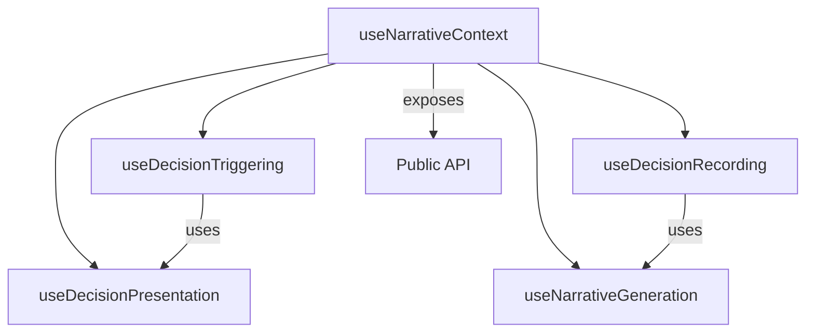

# Narrative Hook Refactoring

## Overview

The `useNarrativeContext` hook has been refactored into a modular architecture to improve maintainability, testability, and readability while maintaining exact functionality. The system now consists of specialized hooks that work together to provide a cohesive API.

## Architectural Changes

The monolithic hook implementation was decomposed into specialized modules:



## File Structure

The refactored system is organized into the following files:

| File | Purpose | Line Count |
|------|---------|------------|
| `useNarrativeContext.ts` | Main hook orchestrator | ~80 lines |
| `types.ts` | Shared types across hooks | ~60 lines |
| `useDecisionPresentation.ts` | Decision presentation logic | ~50 lines |
| `useDecisionRecording.ts` | Recording player choices | ~130 lines |
| `useNarrativeGeneration.ts` | AI narrative generation | ~75 lines |
| `useDecisionTriggering.ts` | Decision triggers and AI decisions | ~180 lines |

## Key Improvements

### Maintainability
- Each file has a clear, single responsibility
- Component interfaces are well-defined and documented
- Dependencies between hooks are explicit

### Testability
- Hooks can be tested in isolation
- Dependencies are easily mockable
- Input/output boundaries are clearly defined

### Performance
- Better dependency arrays for useCallback
- Improved state update flow
- Type safety throughout

### Documentation
- Comprehensive JSDoc comments
- Clear parameter types
- Consistent module structure

## Implementation Strategy

The refactoring followed these principles:

1. **No functionality changes** - Exact behavior preserved
2. **Clear separation of concerns** - Each hook handles one aspect
3. **Type safety preservation** - All types maintained or improved
4. **Documentation improvement** - Added detailed JSDoc comments

## Integration with Existing Systems

The refactored system maintains all existing integration points:

- Same API interface through the main hook
- Compatible with existing component usage
- Backward compatibility through re-export

## Testing Strategy

Unit tests validate each hook's functionality:

```typescript
describe('useDecisionPresentation', () => {
  it('should dispatch presentDecision action when presenting a decision', () => {
    // Setup mock context
    const mockDispatch = jest.fn();
    const mockContext = {
      state: mockNarrativeState,
      dispatch: mockDispatch
    };
    
    // Render the hook
    const { result } = renderHook(() => useDecisionPresentation(mockContext));
    
    // Call the presentPlayerDecision function
    act(() => {
      result.current.presentPlayerDecision(mockDecision);
    });
    
    // Assert dispatch was called with correct action
    expect(mockDispatch).toHaveBeenCalledWith(
      presentDecision(mockDecision)
    );
  });
});
```

## Usage Examples

The API remains the same, so existing code continues to work:

```tsx
function DecisionComponent() {
  const { 
    currentDecision,
    recordPlayerDecision,
    isGeneratingNarrative
  } = useNarrativeContext();
  
  if (!currentDecision) return null;
  
  const handleSelectOption = (optionId: string) => {
    recordPlayerDecision(currentDecision.id, optionId);
  };
  
  return (
    <div className="decision-panel">
      <h2>{currentDecision.prompt}</h2>
      {currentDecision.options.map(option => (
        <button 
          key={option.id}
          onClick={() => handleSelectOption(option.id)}
          disabled={isGeneratingNarrative}
        >
          {option.text}
        </button>
      ))}
    </div>
  );
}
```

## Related Documentation

- [[narrative-architecture|Narrative System Architecture]]
- [[narrative-context-refactoring|Narrative Context Builder Refactoring]]
- [[../core-systems/narrative-system|Narrative System Overview]]
