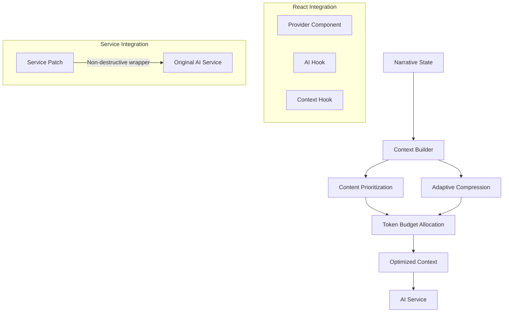

# Narrative Context Optimization System

## Overview

The Narrative Context Optimization system intelligently processes narrative content for AI prompts, improving response quality while reducing token usage. By prioritizing relevant narrative elements and applying adaptive compression, the system ensures the AI has the most important context within token limits.

## Architecture

The system implements a layered architecture designed to be non-destructive and fully compatible with existing code:



## Key Components

### Provider Component

```tsx
// In app/layout.tsx
<NarrativeOptimizationProvider>
  {children}
</NarrativeOptimizationProvider>
```

The `NarrativeOptimizationProvider` component:

1. Initializes the optimization system
2. Applies the game service patch
3. Registers debug tools (in development)
4. Sets up optimization telemetry

### React Hooks

The system provides several React hooks for integration:

1. **`useAIWithOptimizedContext`**: Main hook for AI integration
   ```tsx
   const { makeAIRequest, isLoading, error } = useAIWithOptimizedContext();
   ```

2. **`useOptimizedNarrativeContext`**: Hook for direct access to context
   ```tsx
   const { getDefaultContext, getFocusedContext } = useOptimizedNarrativeContext();
   ```

3. **`useNarrativeContextSynchronization`**: Ensures fresh context before AI requests
   ```tsx
   const { ensureFreshContext } = useNarrativeContextSynchronization();
   ```

### Core Utilities

1. **`narrativeContextBuilder`**: Builds optimized context from state
2. **`narrativeCompression`**: Implements compression algorithms
3. **`optimizationEnhancements`**: Provides caching and optimization utilities

### Game Service Integration

The system patches the game service non-destructively:

```typescript
// Original function reference is preserved
const originalGetAIResponse = global.getAIResponse;

// New function wraps the original with optimization
global.getAIResponse = async function(...args) {
  // Apply optimization
  const optimizedContext = getOptimizedContextForAI(...);
  
  // Call original with optimized context
  return originalGetAIResponse(..., optimizedContext, ...);
};
```

## Optimization Process

The context optimization follows these steps:

1. **Extraction**: Extract narrative elements from state (history, decisions, relationships)
2. **Prioritization**: Score and prioritize elements based on relevance, recency, and importance
3. **Compression**: Apply appropriate compression level based on content size
4. **Token Allocation**: Distribute available tokens across different content types
5. **Formatting**: Format the optimized context for optimal AI consumption

## Compression Levels

The system supports four compression levels:

| Level | Description | Token Reduction | Use Case |
|-------|-------------|----------------|----------|
| none | No compression | 0% | Short histories, debugging |
| low | Light compression | ~10-20% | Moderate histories |
| medium | Balanced compression | ~30-40% | Most game situations |
| high | Aggressive compression | ~50-60% | Very long histories |

Compression is applied intelligently, preserving key information:
- Named entities (characters, locations)
- Key verbs and actions
- Important objects and items
- Relationship-defining interactions

## Token Budget Allocation

Available tokens are allocated across different content types:

- **Narrative History**: 40% (recent events, key moments)
- **Decision History**: 30% (player choices, consequences)
- **World State**: 15% (game world status, faction relationships)
- **Character Relationships**: 10% (character interactions, reputation)
- **Story Context**: 5% (themes, arcs, background)

## Performance Optimizations

The system includes several performance optimizations:

1. **Context Caching**: Recent contexts are cached to avoid rebuilding
2. **Adaptive Compression**: Compression level adapts to narrative size
3. **Efficient Token Estimation**: Uses approximation for speed
4. **Targeted Updates**: Only rebuilds context when narrative state changes

## Debug Tools

In development mode, debug tools are available:

```javascript
// Show current optimized context with stats
window.bhgmDebug.narrativeContext.showOptimizedContext();

// Test different compression levels
window.bhgmDebug.narrativeContext.testCompression("Your sample text");

// Get optimization metrics
window.bhgmDebug.narrativeContext.metrics.getSummary();

// Analyze narrative history
window.bhgmDebug.narrativeContext.analyzeHistory();
```

## Integration with Existing Systems

The optimization system integrates with these existing systems:

- **Narrative Context**: Provides the narrative state
- **Game Service**: Handles AI communication
- **Decision System**: Prioritizes relevant decisions

## Solution for Stale Context Issue (#210)

The implementation addresses the stale context issue through the `useNarrativeContextSynchronization` hook:

```typescript
function useNarrativeContextSynchronization() {
  const { state, dispatch } = useNarrative();
  
  // Ensure context is fresh before making AI requests
  const ensureFreshContext = useCallback(async () => {
    // Force a state update to ensure we have the freshest state
    await new Promise<void>(resolve => {
      // Dispatch a minimal update to trigger state refresh
      dispatch({ type: 'UPDATE_NARRATIVE', payload: {} });
      
      // Wait for next frame to ensure state is updated
      requestAnimationFrame(() => {
        resolve();
      });
    });
    
    return state;
  }, [state, dispatch]);
  
  return { ensureFreshContext };
}
```

This ensures that AI decisions are always made with the most current narrative context, preventing the stale context issues previously seen.

## Usage Examples

### Basic Integration

```tsx
import { NarrativeOptimizationProvider } from './components/NarrativeOptimizationProvider';
import GamePromptWithOptimizedContext from './components/GamePromptWithOptimizedContext';

// Add provider to layout
function AppLayout({ children }) {
  return (
    <NarrativeOptimizationProvider>
      {children}
    </NarrativeOptimizationProvider>
  );
}

// Use optimized prompt component
function GameUI() {
  return (
    <div>
      <GameNarrative />
      <GamePromptWithOptimizedContext />
    </div>
  );
}
```

### Custom Integration

```tsx
import { useAIWithOptimizedContext } from '../utils/narrative';

function CustomGamePrompt() {
  const { makeAIRequest, isLoading } = useAIWithOptimizedContext();
  
  const handlePrompt = async (prompt) => {
    try {
      const response = await makeAIRequest(prompt, inventory);
      // Process response...
    } catch (error) {
      // Handle error...
    }
  };
  
  return (
    <form onSubmit={/* ... */}>
      {/* Your UI */}
    </form>
  );
}
```

## Related Documentation

- [[narrative-architecture|Narrative System Architecture]]
- [[../core-systems/ai-integration|AI Integration]]
- [[../features/narrative-system|Narrative System Overview]]
