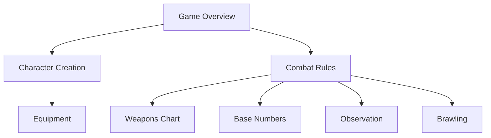

# Boot Hill Rules Reference

This Map of Content (MOC) provides a comprehensive overview of the Boot Hill v2 rules implementation in BootHillGM.

## Core Rules
- [[game-overview|Game Overview]] - Basic game concepts and mechanics
- [[character-creation|Character Creation]] - Character generation rules
- [[combat-rules|Combat Rules]] - Core combat mechanics

## Equipment and Resources
- [[equipment|Equipment Rules]] - General equipment rules
- [[weapons-chart|Weapons Chart]] - Weapon statistics and rules
- [[misc-characters|Misc Characters Chart]] - NPC statistics

## Game Mechanics
- [[base-numbers|Base Numbers Calculation]] - Core game calculations
- [[observation-sighting|Observation and Sighting]] - Perception rules
- [[brawling-context|Brawling Rules]] - Hand-to-hand combat
- [[campaign-rules|Campaign Rules]] - Extended gameplay rules

## Rules Implementation

## System Integration
### Core Systems
- [[../core-systems/combat-system|Combat System Implementation]]
- [[../core-systems/state-management|State Management]]
- [[../core-systems/combat-modifiers|Combat Modifiers]]

### AI Integration
- [[../ai/game-master-logic|Game Master Logic]]
- [[../ai/training-data/boot-hill-v2-rules|Rules Training Data]]
- [[../ai/training-data/western-themes|Western Themes]]

## Rule Categories
| Category | Implementation | Automation |
|----------|----------------|------------|
| Character Creation | Complete | Full |
| Combat | Complete | Full |
| Equipment | Complete | Partial |
| Observation | Complete | Partial |
| Campaign | In Progress | Partial |

## Reference Materials
### Technical Implementation
- [[../architecture/component-structure|Component Structure]]
- [[../technical-guides/testing|Testing Guide]]

### Feature Implementation
- [[../features/_completed/character-creation|Character Creation]]
- [[../features/_completed/combat-base|Combat Base]]
- [[../features/_current/inventory-interactions|Inventory]]

## Related Documentation
- [[../meta/game-design|Game Design Document]]
- [[../planning/requirements/combat|Combat Requirements]]
- [[../planning/requirements/characters|Character Requirements]]