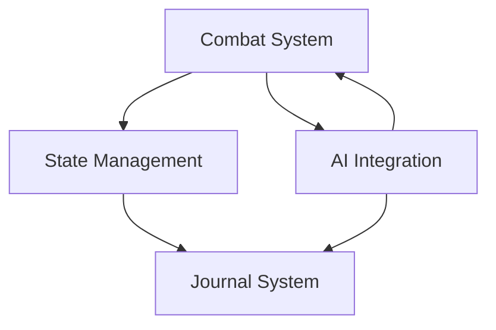

# Core Systems Overview

This Map of Content (MOC) provides an overview of all core systems in the BootHillGM application.

## Combat Systems
- [[combat-system|Combat System]] - Main combat engine and mechanics
- [[combat-modifiers|Combat Modifiers]] - Modifiers affecting combat outcomes

## State Management
- [[state-management|State Management]] - Game state and persistence
- [[journal-system|Journal System]] - Game history and event tracking

## AI Integration
- [[ai-integration|AI Integration]] - Core AI system integration
- Related: [[../ai/game-master-logic|Game Master Logic]]

## System Relationships

## Implementation Status
| System | Status | Priority |
|--------|---------|-----------|
| Combat System | Active | High |
| State Management | Active | High |
| Journal System | Active | Medium |
| AI Integration | Active | High |

## Related Documentation
- [[../architecture/component-structure|Component Structure]]
- [[../technical-guides/testing|Testing Guide]]
- [[../planning/roadmap|Development Roadmap]]