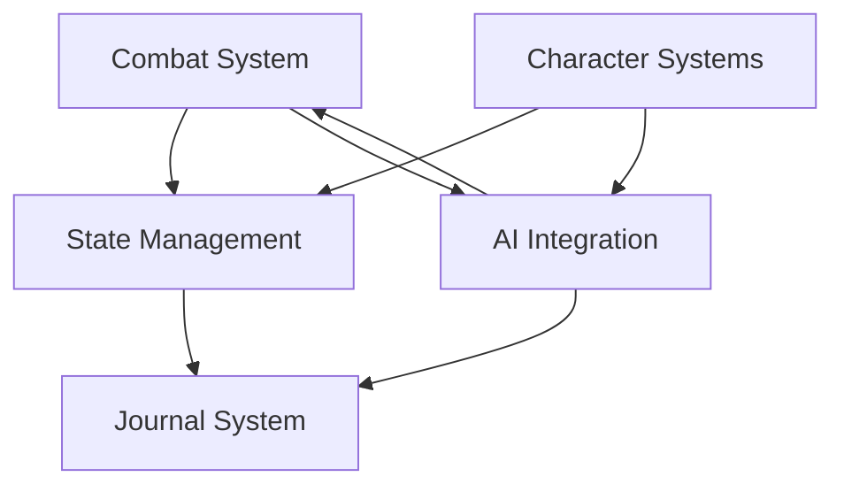

# Core Systems Overview

## Overview
This document provides a comprehensive overview of the core systems that power the BootHillGM application.

## Purpose
The Core Systems documentation aims to:
- Provide a high-level understanding of system architecture
- Document relationships between different systems
- Track implementation status and priorities
- Serve as a reference for developers working on system components

# Core Systems Overview

This Map of Content (MOC) provides an overview of all core systems in the BootHillGM application.

## Combat Systems
- [[./combat-system|Combat System]] - Main combat engine and mechanics
- [[./combat-modifiers|Combat Modifiers]] - Modifiers affecting combat outcomes
- Combat Summary - Detailed stats tracking

## State Management
- [[./state-management|State Management]] - Game state and persistence
- [[./journal-system|Journal System]] - Game history and event tracking

## Character Systems
- [[./character-generation|Character Generation]] - Character creation and validation
  - Logging Infrastructure
  - Validation Framework
  - Error Handling
- [[./character-persistence|Character Persistence]] - Character data management

## AI Integration
- [[./ai-integration|AI Integration]] - Core AI system integration
- Related: [[../ai/game-master-logic|Game Master Logic]]

## System Relationships

## Implementation Status
| System | Status | Priority |
|--------|---------|-----------|
| Combat System | Active | High |
|   - Combat Summary | Complete | High |
| State Management | Active | High |
| Journal System | Active | Medium |
| AI Integration | Active | High |
| Character Generation | Complete | High |

## Recent Combat System Updates
- Added combat summary system with detailed stats tracking
  - Victory/defeat messages
  - Combat statistics (rounds, damage)
  - Integration with combat log display

## Related Documentation
- [[../architecture/component-structure|Component Structure]]
- [[../technical-guides/testing|Testing Guide]]
- [[../planning/roadmap|Development Roadmap]]

## Recent Updates
- Added character generation logging system
- Implemented character data validation
- Enhanced error handling for character creation
- Added comprehensive testing coverage