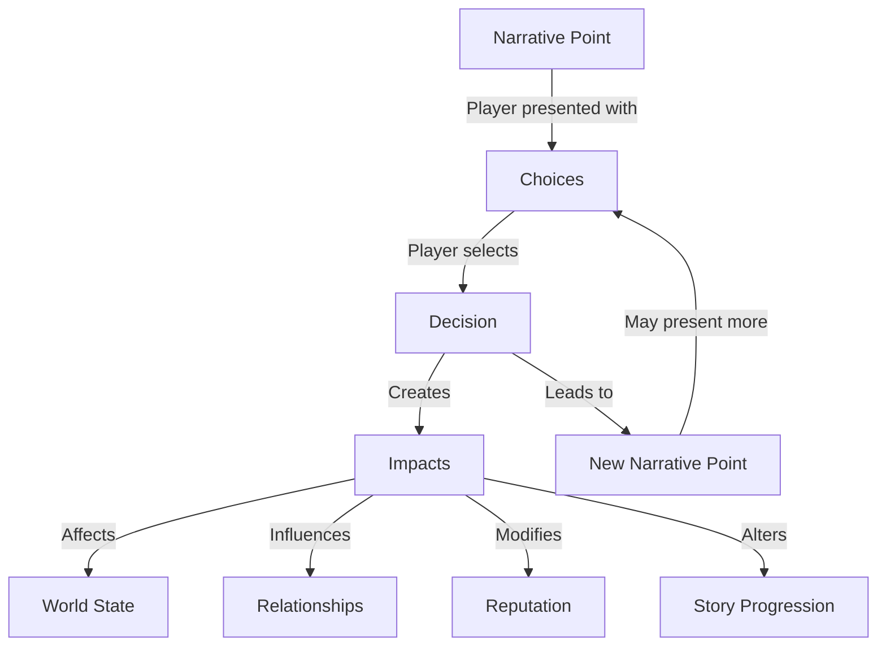

# Narrative System

## Overview

The Narrative System is the core storytelling engine of BootHillGM, responsible for managing the flow of the narrative, tracking player choices, and evolving the story based on player decisions. It provides a framework for branching narratives with meaningful consequences that persist throughout the game experience.

## Key Components

### 1. Story Management

- **Story Points**: Discrete narrative elements with text, choices, and metadata
- **Narrative Arcs**: Larger story structures composed of multiple related points
- **Narrative Branches**: Divergent paths based on player choices
- **Narrative Context**: Additional information that informs story generation

### 2. Decision Tracking

- **Decision Presentation**: Shows contextual choices to players
- **Decision Recording**: Captures player choices and their narrative impact
- **Decision History**: Maintains a record of past decisions for future reference
- **Decision Impact System**: Tracks how choices affect the game world over time

### 3. History Management

- **Narrative History**: Complete record of narrative text displayed to the player
- **Visited Points**: Tracking of which story points have been explored
- **Display Modes**: Various presentation styles for different narrative contexts

## Flow Diagram

## Impact Types

The Narrative System tracks several types of impacts from player decisions:

1. **Reputation**: How the player and their party are viewed by others
2. **Relationships**: Connections between specific characters
3. **World State**: Changes to the game world (town prosperity, danger level, etc.)
4. **Story Progression**: Advancement in specific narrative arcs

Impact severity varies (minor, moderate, major) and can evolve over time - some impacts fade while others become permanent aspects of the game world.

## Integration with Other Systems

The Narrative System connects with other core systems in BootHillGM:

- **Player Decision System**: Presents meaningful choices and captures player responses
- **Journal System**: Records important story developments and choices
- **Character System**: Character traits influence available choices and outcomes
- **Combat System**: Story events can trigger or be affected by combat

## Example Narrative Flow

1. Player encounters a story point: "You see smoke rising from the town ahead"
2. System presents choices:
   - "Approach cautiously to investigate"
   - "Ride in quickly to offer help"
   - "Find a vantage point to observe first"
3. Player selects "Find a vantage point"
4. System records this decision and its context
5. Narrative continues based on this choice
6. The decision impacts reputation (cautious), relationships (townsfolk), and future story options

## Technical Implementation

The Narrative System is implemented using a Redux-style architecture with:

- **Reducers**: Handle state updates for narrative progression
- **Action Creators**: Define available operations on the narrative state
- **Utility Functions**: Provide common operations for narrative manipulation
- **Type Definitions**: Ensure consistent data structures throughout

For more technical details, see the [Architecture Documentation](../architecture/narrative-architecture.md).

## Related Systems

- [[player-decision-system|Player Decision System]]
- [[journal-system|Journal System]]
- [[state-management|State Management]]
- [[ai-integration|AI Integration]]
