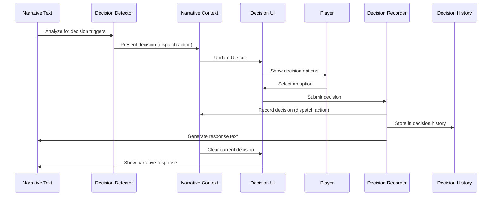

# Player Decision System

## Overview

The Player Decision System is a core component of BootHillGM that enables interactive storytelling by presenting players with meaningful choices and tracking their decisions throughout the game. This system serves as the primary mechanism for player agency, allowing them to influence the narrative direction and outcome of the game.

## Key Components

### 1. Data Model

The system is built around these key data structures:

- **PlayerDecision**: Represents a decision point presented to the player, including:
  - A prompt describing the decision
  - Multiple options to choose from
  - Contextual information
  - Importance level (critical, significant, moderate, minor)
  - Associated characters and location

- **PlayerDecisionOption**: Represents a single choice within a decision, including:
  - Display text for the option
  - Description of potential impact
  - Tags for categorization

- **PlayerDecisionRecord**: Stores the history of a player's decision, including:
  - Reference to the original decision
  - Which option was selected
  - Timestamp of the decision
  - Narrative response after the decision
  - Relevance scoring for future reference

### 2. Component Architecture

The system consists of these React components:

- **NarrativeWithDecisions**: Container component that manages the display of both narrative text and decision cards.
  - Handles transitions between narrative and decision states
  - Manages error states and recovery
  - Provides emergency controls for edge cases

- **PlayerDecisionCard**: Displays an individual decision with its options and allows the player to make a choice.
  - Visual styling based on decision importance
  - Option selection and submission
  - Error handling and feedback

### 3. State Management

The decision state is managed through:

- **NarrativeContext**: React context that provides decision state and functions to components.
- **narrativeReducer**: Reducer that handles state transitions for decisions.
- **useNarrativeContext**: Custom hook that provides a friendly API for working with decisions.

## Flow Diagram



## Decision Triggering

Decisions can be triggered in two ways:

1. **Keyword Detection**: The system analyzes narrative text for phrases like "What will you do?" or "Choose your next action" to identify potential decision points.

2. **AI Integration (Planned)**: In future versions, an AI system will analyze the narrative context to identify appropriate decision points and generate contextually relevant options.

## Decision Recording Process

When a player makes a decision:

1. The `PlayerDecisionCard` component captures the selected option
2. The `recordPlayerDecision` function from `useNarrativeContext` is called
3. The decision is validated and a narrative response is generated
4. A `PlayerDecisionRecord` is created and saved to the decision history
5. The narrative history is updated with the response text
6. The decision is cleared from the current state
7. UI components update to reflect the new state

This workflow is transaction-like. If any step fails, the operation rolls back by clearing the decision without recording it.

## Decision History and Relevance

The system maintains a history of player decisions with relevance scoring to:

- Inform future AI-generated content
- Allow for narrative callbacks to past decisions
- Evaluate the long-term impact of player choices

Decision relevance decays over time, with the rate of decay depending on the importance of the decision.

## Custom Hooks API

The `useNarrativeContext` hook provides these key functions:

```typescript
// Present a decision to the player
presentPlayerDecision(decision: PlayerDecision): void;

// Record a player's decision
recordPlayerDecision(decisionId: string, optionId: string): Promise<void>;

// Clear the current decision without recording it
clearPlayerDecision(): void;

// Get decision history filtered by tags
getDecisionHistory(tags?: string[]): PlayerDecisionRecord[];

// Check narrative text for decision triggers
checkForDecisionTriggers(narrativeText: string): boolean;

// Trigger an AI-generated decision
triggerAIDecision(context: string, importance?: DecisionImportance): boolean;
```

## Cross-Component Communication

The system uses a combination of React's context API and a custom event-based approach for robust cross-component communication:

```typescript
// Dispatch a storage event to force updates across components
setTimeout(() => {
  window.dispatchEvent(new Event('storage'));
}, 50);

// Listen for storage events in components
useEffect(() => {
  const handleStorageEvent = () => {
    // Update component state based on context
    if (hasActiveDecision && currentDecision) {
      setShowDecision(true);
    } else {
      setShowDecision(false);
    }
  };
  
  window.addEventListener('storage', handleStorageEvent);
  return () => window.removeEventListener('storage', handleStorageEvent);
}, [hasActiveDecision, currentDecision]);
```

This approach solves the common React challenge of propagating state changes across deeply nested component trees.

## UI Transitions

The system uses CSS transitions for smooth visual flow between narrative and decision states:

```css
.bhgm-narrative-transition-in {
  opacity: 1;
  transform: translateY(0);
  transition: all 0.3s ease-in-out;
}

.bhgm-narrative-transition-out {
  opacity: 0;
  transform: translateY(-20px);
  transition: all 0.3s ease-in-out;
}
```

These transitions provide visual feedback to players, making the interface feel responsive and engaging.

## Future Enhancements

Planned enhancements to the system include:

1. **AI-Driven Decision Generation**: Using AI to create contextually appropriate decisions and options.
2. **Dynamic Relevance Scoring**: More sophisticated algorithms for determining decision relevance.
3. **Decision Impact Visualization**: UI components to show how past decisions have affected the game.
4. **Branching Narrative Paths**: More complex branching based on combinations of decisions.
5. **Decision Analytics**: Tools for developers to analyze player decision patterns.

## Integration with Other Systems

The Player Decision System integrates with other core systems:

- **Narrative System**: Decisions affect and are triggered by narrative content.
- **Character System**: Character attributes and relationships influence decision availability and outcomes.
- **Combat System**: Decisions can trigger or affect combat scenarios.
- **Journal System**: Important decisions are recorded in the player's journal.

## Technical Implementation Notes

- The system uses React's `useReducer` and Context API for state management
- CSS Modules are used for component-specific styling
- TypeScript interfaces ensure type safety throughout the system
- Jest tests verify correct behavior of all components and functions
- The system is designed for extensibility with AI-driven enhancements
