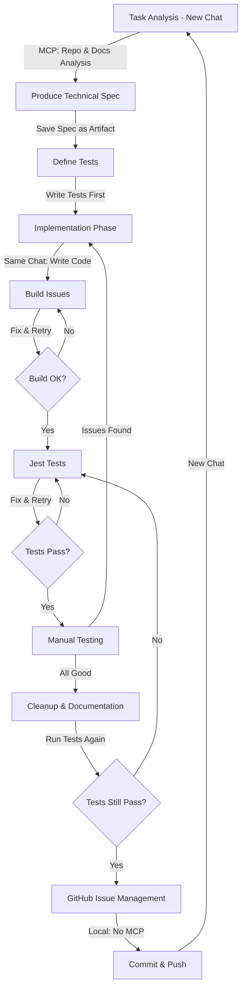

# Claude App Development Workflow

> [!note] 
> Optimized development workflow using Claude's app interface with MCP tools, designed for test-driven development with a KISS (Keep It Simple, Stupid) mindset.

## Development Flow


## Workflow Phases

### 1. Task Analysis (New Chat)
**Purpose:** Select and plan next most valuable task
**Output:** Technical specification as artifact

Start each task with a fresh chat:
```
I need to analyze a task for my BootHillGM project. Please use MCP to:
1. Check the GitHub repo at https://github.com/jerseycheese/BootHillGM
2. Review docs at /Users/jackhaas/Projects/BootHillGM/Docs
3. Help me [select a task from issues OR analyze this specific task: X]

Focus on keeping the solution simple and straightforward (KISS principle).
```

**Key MCP Tools:**
- `list_directory` to explore repo structure
- `read_file` for roadmaps and issues
- `search_files` to find related code

**Expected Output:**
- Technical specification as an artifact
- Implementation steps prioritizing simplicity
- Files that need to be modified

### 2. Define Tests First (Same Chat)
**Purpose:** Apply TDD principles by defining expected behavior
**Output:** Test specifications as artifacts

Before writing implementation code:
```
Now that we have the technical spec, let's define the Jest tests first. 
These tests should specify:
1. The expected behavior of the component
2. Edge cases to handle
3. Only test what's necessary (KISS principle)
```

**Key MCP Tools:**
- `read_file` to examine existing test files
- `search_files` to find similar test patterns

**Test Format:**
- Provide test code as artifacts
- Focus on the minimum tests needed to verify functionality
- Include data-testid attributes needed for testing

### 3. Implementation Phase (Same Chat)
**Purpose:** Write minimal code to make tests pass
**Output:** Code artifacts that implement the tests

After defining tests, proceed to implementation:
```
With our tests defined, let's implement the component with the simplest 
code that will make these tests pass. Keep the implementation:
1. Minimal and focused
2. Easy to understand
3. Aligned with project patterns
```

**Key MCP Tools:**
- `read_file` to examine existing similar components
- `read_multiple_files` to understand patterns

**Code Format:**
- Provide implementation code as artifacts
- Focus on making tests pass with minimal complexity
- Include only what's needed, avoid premature optimization

### 4. Build Issues (Same Chat if Possible)
**Purpose:** Resolve any build errors
**Output:** Fixed code that builds successfully

After implementation:
```
Let's check for potential build issues:
1. TypeScript errors
2. Import/export problems
3. Missing dependencies

Please help me resolve these with minimal changes.
```

**Iterative Process:**
- Fix build errors first before proceeding
- Return to implementation if substantial changes needed
- Only move forward when build succeeds

### 5. Jest Tests (Same Chat if Possible)
**Purpose:** Ensure tests pass
**Output:** Working code verified by tests

After build issues are fixed:
```
Now let's run and fix the Jest tests. We need to:
1. Address any failing tests
2. Make minimal changes to make tests pass
3. Avoid introducing unnecessary complexity
```

**Iterative Process:**
- Fix failing tests one by one
- Return to implementation if substantial changes needed
- Only move forward when all tests pass

### 6. Manual Testing (Same Chat if Possible)
**Purpose:** Verify user experience
**Output:** Final adjustments for real-world usage

After tests pass:
```
Now that all tests pass, let's manually test the implementation:
1. What behavior should I verify?
2. Are there any UI concerns tests might miss?
3. How should I test edge cases?
```

**Feedback Loop:**
- Document issues found during manual testing
- Return to implementation if issues require code changes
- Run both build and tests again after changes

### 7. Cleanup & Documentation (Same Chat if Possible)
**Purpose:** Clean up code and update documentation
**Output:** Clean codebase, updated documentation

After all testing is successful:
```
Now that implementation is complete and verified, let's:
1. Clean up the code (remove console.logs, TODOs)
2. Update documentation
3. Ensure inline comments explain complex logic
4. Verify tests still pass after cleanup
```

**Key MCP Tools:**
- `read_file` on existing docs to maintain consistency
- `search_files` to find places needing docs updates

**Important:** Always run tests again after cleanup to ensure nothing broke.

### 8. GitHub Issue Management
**Purpose:** Track work and maintain project backlog
**Output:** Updated GitHub issues

```
Let's finalize this feature by:
1. Creating a summary for the GitHub issue
2. Drafting any follow-up issues needed
3. Preparing closing notes for the current issue
```

## KISS Principles for AI-Assisted Development

### Code Simplicity Guidelines
1. **Minimize Props**: Only include props that are actually needed
2. **Avoid Premature Abstraction**: Start concrete, abstract only when patterns emerge
3. **Prefer Pure Components**: Minimize side effects and state management
4. **Single Responsibility**: Each component should do one thing well
5. **Readable Over Clever**: Choose clarity over brevity or performance tricks

### Prompt Patterns for Simple Code
When asking Claude for implementation:
```
Please implement this component with the simplest approach possible:
- Prefer readability over performance optimization
- Use standard React patterns over complex solutions
- Only add complexity where absolutely necessary
- Explain any non-obvious code choices
```

## Recognizing the Build-Test-Fix Cycle

**Expected Workflow Reality:**
- You will likely cycle through build errors → test fixes → implementation changes multiple times
- This is normal and expected in React development
- Always fix build errors first, then Jest tests, before manual testing
- After manual testing issues, start the cycle again
- Only proceed to cleanup when all tests and manual verification pass

## Artifact Usage

### Key Artifacts
- **Test specifications**: Written before implementation
- **Component code**: React component implementations
- **Build error fixes**: Specific changes to resolve build issues
- **Test fixes**: Code changes to make tests pass
- **Documentation**: Updates to project docs

### Best Practices
- Use separate artifacts for tests and implementation
- Update artifacts incrementally instead of recreating
- Start simple, add complexity only when needed
- Run tests after every significant change

## Document Templates

### Test Specification Artifact
```markdown
# Tests for [Component]

## Unit Tests
\`\`\`jsx
import { render, screen } from '@testing-library/react';
import userEvent from '@testing-library/user-event';
import [Component] from './[Component]';

describe('[Component]', () => {
  test('renders correctly with default props', () => {
    // Test minimum viable rendering
  });
  
  test('handles user interaction', async () => {
    // Test basic interactivity
  });
  
  test('edge case: [description]', () => {
    // Test important edge cases
  });
});
\`\`\`

## Test Checklist
- [ ] Basic rendering
- [ ] User interactions
- [ ] Prop variations
- [ ] Edge cases
- [ ] Error handling
```

### Implementation Artifact
```markdown
# Implementation for [Component]

## Component Implementation
\`\`\`jsx
import React from 'react';
// Minimal imports

// Simple implementation that passes tests
const [Component] = ({ prop1, prop2 }) => {
  // Minimal state and effects
  
  return (
    <div data-testid="component">
      {/* Simple JSX structure */}
    </div>
  );
};

export default [Component];
\`\`\`

## Implementation Notes
- Follows KISS principle by [explanation]
- Handles edge cases by [explanation]
- Areas that might need future optimization: [list]
```

## TDD Workflow Shell Script

You can use this script to enforce the TDD workflow with KISS principles:

```bash
#!/bin/bash
# TDD Workflow for BootHillGM

GREEN='\033[0;32m'
YELLOW='\033[1;33m'
RED='\033[0;31m'
BLUE='\033[0;34m'
NC='\033[0m' # No Color

echo -e "${BLUE}=== BootHillGM TDD Workflow ===${NC}"

# Step 1: Validate tests exist
echo -e "\n${YELLOW}STEP 1: Checking for test files...${NC}"
TEST_FILES=$(find src -name "*.test.tsx" -o -name "*.test.ts")

if [ -z "$TEST_FILES" ]; then
  echo -e "${RED}No test files found! Write tests first before implementation.${NC}"
  exit 1
fi

echo -e "${GREEN}Test files found! Now building...${NC}"

# Step 2: Check for build errors
echo -e "\n${YELLOW}STEP 2: Checking for build errors...${NC}"
npm run build

if [ $? -ne 0 ]; then
  echo -e "\n${RED}Build failed! Fix build errors before continuing.${NC}"
  exit 1
fi

echo -e "${GREEN}Build successful! Running tests...${NC}"

# Step 3: Run Jest tests
echo -e "\n${YELLOW}STEP 3: Running Jest tests...${NC}"
npm test

if [ $? -ne 0 ]; then
  echo -e "\n${RED}Tests failed! Fix test issues before manual testing.${NC}"
  exit 1
fi

echo -e "${GREEN}All tests passed! Ready for manual testing.${NC}"

# Step 4: Start dev server for manual testing
echo -e "\n${YELLOW}STEP 4: Starting dev server for manual testing...${NC}"
echo -e "Press Ctrl+C when done with manual testing."
npm run dev
```

## Related Documents
- [[tdd-with-kiss|Test-Driven Development with KISS]]
- [[kiss-principles-react|KISS Principles for React]]
- [[claude-app-mcp-optimization|MCP Optimization Guide]]
- [[claude-app-prompt-templates|Prompt Templates]]
