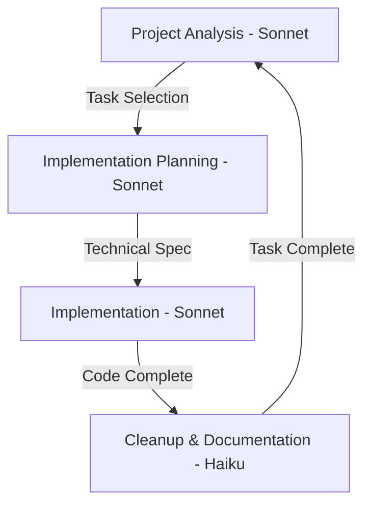

# Four-Phase Claude Development Workflow

> [!note] 
> Structured development workflow using distinct analysis, planning, implementation, and cleanup phases with Claude 3.5 Sonnet and Claude 3 Haiku.

## Development Flow


## Workflow Phases

### 1. Project Analysis (Sonnet)
**Purpose:** Select next most valuable task
**Output:** Task Analysis Document

> [!tip] Use [[examples/project-analysis-prompt|Project Analysis Prompt]]

Selection Criteria:
1. Priority & blocking status
2. Dependencies
3. Technical complexity
4. Value/effort ratio

### 2. Implementation Planning (Sonnet)
**Purpose:** Create technical specification
**Output:** Technical Specification Document

> [!tip] Use [[examples/implementation-plan-prompt|Implementation Plan Prompt]]

Planning Focus:
1. Technical design
2. Interfaces
3. Data flow
4. Test strategy
5. Migration steps

### 3. Implementation (Sonnet)
**Purpose:** Execute technical specification
**Output:** Code Changes, Tests, Core Documentation

> [!tip] Use [[examples/implementation-prompt|Implementation Prompt]]

Implementation Steps:
1. Write tests
2. Create/update interfaces
3. Implement core changes
4. Verify criteria
5. Add essential docs

### 4. Cleanup & Documentation (Haiku)
**Purpose:** Clean up code and update documentation
**Output:** Clean codebase, updated documentation, closed issues

> [!tip] Use [[examples/cleanup-docs-prompt|Cleanup & Documentation Prompt]]

Cleanup Steps:
1. Update project docs
2. Clean up code
3. Review/update tests
4. Update issues
5. Final commit

## Phase Transitions

### Project Analysis → Planning
1. Complete analysis document
2. Verify selection criteria
3. Create planning chat
4. Hand off analysis

### Planning → Implementation
1. Complete technical spec
2. Verify interfaces defined
3. Create implementation chat
4. Hand off spec

### Implementation → Cleanup
1. Verify implementation
2. Basic tests passing
3. Create cleanup chat
4. Hand off summary

### Cleanup → Next Analysis
1. Verify criteria met
2. Close issues
3. Create analysis chat
4. Begin next task

## Document Templates

### Task Analysis Document
```markdown
TASK ANALYSIS
GitHub Issue: #[number] [title]
Labels: [high-priority, bug, feature, etc]
Description: [1-2 sentences]
Priority: [High/Medium/Low] ([reasoning])
Current State: [1-2 sentences]

IMPLEMENTATION STEPS
1. [ ] [First step]
2. [ ] [Second step]

NEXT IMPLEMENTATION TASK
Description: [Clear description]
Files to Modify:
- [path]: [changes]
Files to Create:
- [path]: [purpose]

SUCCESS CRITERIA
- [ ] [criterion]
- [ ] [criterion]

TECHNICAL NOTES
- [technical detail]
- [technical detail]

FUTURE TASKS
- [ ] [future task]
- [ ] [future task]
```

### Technical Specification Document
```markdown
IMPLEMENTATION SPECIFICATION
Component: [name]
Issue: [reference]

TECHNICAL DESIGN
Data Flow:
- [flow point 1]
- [flow point 2]

Core Changes:
1. [Change Area 1]
   - Location: [file]
   - Details: [specifics]
   
2. [Change Area 2]
   - Location: [file]
   - Details: [specifics]

INTERFACES
[Interface definitions]

TEST PLAN
1. Unit Tests:
   - [test scenario]
2. Integration Tests:
   - [test scenario]

MIGRATION PLAN
1. [Step 1]
2. [Step 2]
```

## Best Practices

### Chat Management
- New chat per phase
- Clear transitions
- Context in handoffs
- Link GitHub issues

### Documentation
- Update during dev
- Keep templates current
- Document decisions
- Note future tasks

### Testing
- Tests first
- Cover edge cases
- Verify criteria

### GitHub Integration
- Reference issues
- Close completed
- Create follow-ups
- Update labels

## Related Documents
- [[examples/project-analysis-prompt|Project Analysis]]
- [[examples/implementation-plan-prompt|Implementation Plan]]
- [[examples/implementation-prompt|Implementation]]
- [[examples/cleanup-docs-prompt|Cleanup & Documentation]]
- GitHub: https://github.com/jerseycheese/BootHillGM
