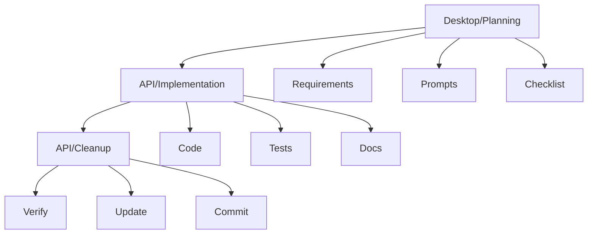

# Claude Workflow

> [!note]
> Three-stage development process using Claude Desktop and API.

## Overview

## Stages

### 1. Planning (Desktop)
- Requirements review
- Implementation prompt
- Verification checklist

### 2. Implementation (API)
- Code generation
- Test creation
- Documentation

### 3. Cleanup (API)
- Issue fixes
- Doc updates
- Commit messages

## Best Practices
1. One component per prompt
2. Include file paths
3. Reference Boot Hill rules
4. Test coverage

## Templates
- [[prompt-guide|Prompt Guide]]
- [[examples/weapon-combat|Example]]

## Related
- [[feature-workflow|Feature Development]]
- [[../../boot-hill-rules/index|Boot Hill Rules]]