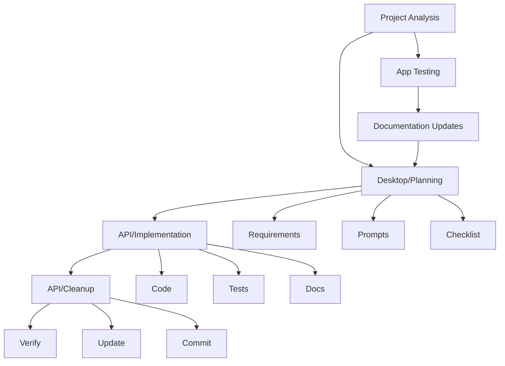

# Claude Workflow

> [!note]
> Three-stage development process using Claude Desktop and API.

## Initial Project Analysis
Before starting development work, use the project analysis prompt to determine the most appropriate next task:

```markdown
You are an AI assistant acting as a React app developer and project manager for the BootHillGM project. Review the current project state and suggest the next development task.

Key files to review:
- /Docs/meta/project-overview.md
- /Docs/planning/requirements/current-stories.md
- /Docs/planning/requirements/user-stories.md
- /Docs/issues/open-issues.md

Analyze the project considering:
1. MVP features status
2. Critical bugs (especially High priority)
3. Implementation dependencies
4. Test coverage needs

Based on your analysis, recommend a single, focused task that:
- Addresses a critical need (bug fix or MVP feature)
- Has clear completion criteria
- Can be completed in a single focused session
- Follows proper implementation order

Provide your recommendation in this format:
<next_task>
1. Task: [Brief description]
2. Priority: [Why this task is important now]
3. Focus Area: [Specific component/feature]
4. Implementation Notes:
   - Files to modify
   - Key considerations
   - Test requirements
</next_task>
```

## App Walkthrough
During app testing, use the documentation assistant to track issues and improvements. See [[examples/walkthrough-documentation-prompt|Documentation Assistant]].

## Development Flow


## Stages

### 1. Planning (Desktop)
- Requirements review
- Implementation prompt
- Verification checklist

### 2. Implementation (API)
- Code generation
- Test creation
- Documentation

### 3. Cleanup (API)
- Issue fixes
- Doc updates
- Commit messages

## Best Practices
1. One component per prompt
2. Include file paths
3. Reference Boot Hill rules
4. Test coverage

## Templates
- [[prompt-guide|Prompt Guide]]
- [[examples/weapon-combat|Example]]
- [[examples/project-analysis-prompt|Project Analysis Examples]]

## Related
- [[feature-workflow|Feature Development]]
- [[../../boot-hill-rules/index|Boot Hill Rules]]