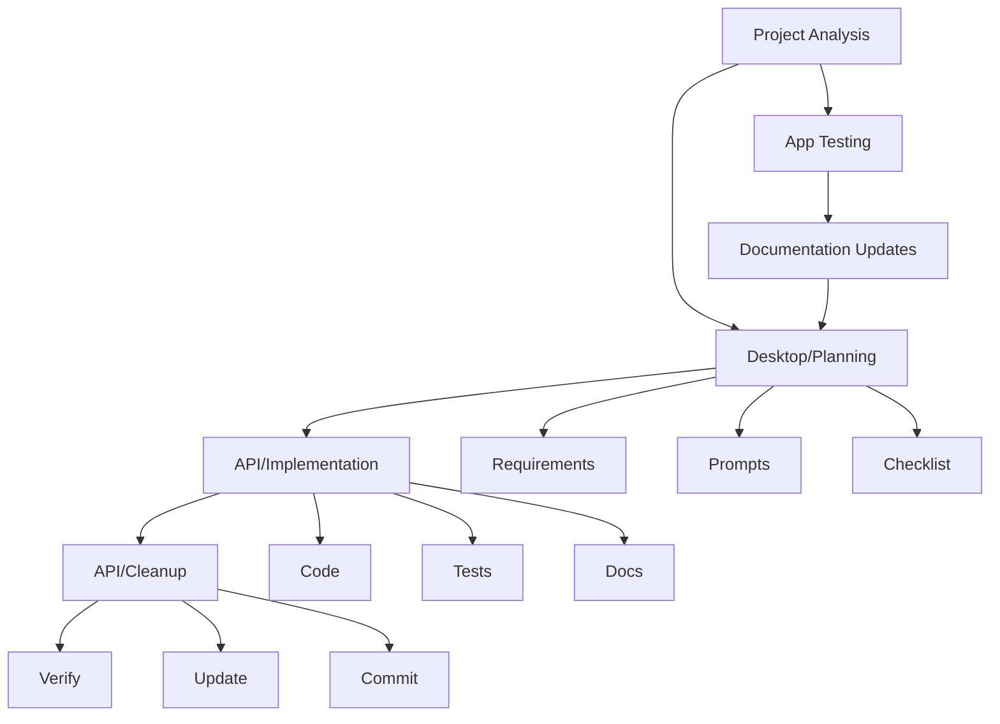

# Claude Workflow

> [!note]
> Three-stage development process using Claude Desktop and API.

## Initial Project Analysis
Before starting development work, use the project analysis prompt to determine the most appropriate next task. See [[examples/project-analysis-prompt|Project Analysis Example]].

## App Walkthrough
During app testing, use the documentation assistant to track issues and improvements. See [[examples/walkthrough-documentation-prompt|Documentation Assistant]].

## Development Flow

## Stages

### 1. Planning (Desktop)
Initial planning and setup stage using Claude Desktop:
- Requirements review: Analyze current stories and open issues
- Implementation prompt: Create focused prompts for specific tasks
- Verification checklist: Define completion criteria

### 2. Implementation (API)
Main development stage using Claude API or Desktop:
1. Code Generation
   - Component implementation
   - State management
   - Game rule integration

2. Test Creation
   - Add focused unit tests for new components
   - Update existing tests as needed
   - See [[examples/test-creation-prompt|Test Creation Guide]]

3. Documentation
   - Update component docs
   - Add implementation notes
   - Record key decisions

### 3. Cleanup (API)
Final polish and verification stage:
1. Code Cleanup
   - Remove debug code
   - Add inline documentation
   - See [[examples/code-cleanup-prompt|Code Cleanup Guide]]

2. Documentation Updates
   - Create session log
   - Review and update relevant docs
   - Prepare commit message
   - See [[examples/doc-updates-prompt|Documentation Updates Guide]]

3. Final Verification
   - Check implementation against requirements
   - Verify test coverage
   - Confirm documentation is current

## Best Practices

1. Component Focus
   - One component per prompt
   - Clear component boundaries
   - Focused testing scope

2. Path Management
   - Include complete file paths
   - Maintain consistent structure
   - Follow project organization

3. Game Rules
   - Reference Boot Hill rules directly
   - Validate rule implementations
   - Document rule applications

4. Testing Approach
   - Focus on key functionality
   - Unit tests for core features
   - Practical test coverage

5. Documentation
   - Keep session logs current
   - Update planning docs
   - Clear commit messages

## Templates
- [[prompt-guide|Prompt Guide]]
- [[examples/weapon-combat|Example]]
- [[examples/project-analysis-prompt|Project Analysis]]
- [[examples/test-creation-prompt|Test Creation]]
- [[examples/code-cleanup-prompt|Code Cleanup]]
- [[examples/doc-updates-prompt|Documentation Updates]]

## Related
- [[feature-workflow|Feature Development]]
- [[../../boot-hill-rules/index|Boot Hill Rules]]