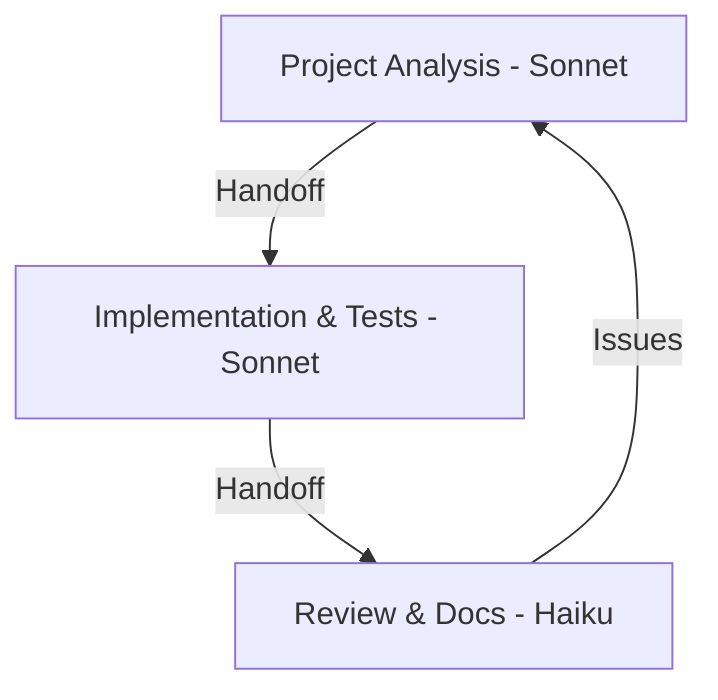

# Streamlined Claude Workflow

> [!note] 
> Rapid development workflow for single-task focus using Sonnet and Haiku.

## Development Flow


## Model Usage & Chat Transitions

### Sonnet (Project Analysis)
- Select next task from backlog
- Analyze requirements
- Plan implementation
- **Creates handoff** for new Sonnet chat

### Sonnet (Implementation & Tests)
- Write and test code
- Error handling
- Build & test verification
- **Creates handoff** for Haiku review

### Haiku (Review & Docs)
- Quick code review
- Update planning docs
- Move completed items

## Handoff Templates

### Analysis → Implementation Handoff
```markdown
TASK ANALYSIS
Story/Issue: [Reference ID]
Description: [1-2 sentences]
Priority: [High/Medium/Low] ([reasoning])
MVP Status: [Required/Optional]
Current State: [1-2 sentences]

IMPLEMENTATION PLAN
Files to Modify:
- [path]: [specific changes]
Files to Create:
- [path]: [purpose]

SUCCESS CRITERIA
- [ ] [testable criterion]
- [ ] [testable criterion]
- [ ] [testable criterion]

TECHNICAL NOTES
- [specific technical detail]
- [specific technical detail]
```

### Implementation → Review Handoff
```markdown
IMPLEMENTATION COMPLETE
Task: [1 sentence]
Story/Issue: [Reference ID]
Build Status: [Pass/Fail]
Test Status: [Pass/Fail]

CHANGES MADE
Files Modified:
- [path]: [what changed]
Files Created:
- [path]: [purpose]

DOCUMENTATION UPDATES
Files to Update:
- [path]: [what to update]
Items to Mark Complete:
- [specific item]
Future Improvements:
- [specific improvement]
```

## Workflow Steps

### 1. Project Analysis (Sonnet)
> [!tip] Use [[examples/project-analysis-prompt|Project Analysis Prompt]]
Key paths:
- /Users/jackhaas/Projects/BootHillGM/Docs/
- /Users/jackhaas/Projects/BootHillGM/Docs/planning/
- /Users/jackhaas/Projects/BootHillGM/Docs/issues/

### 2. Implementation & Tests (Sonnet)
> [!tip] Use [[examples/implementation-plan-prompt|Implementation Prompt]]
Key paths:
- /Users/jackhaas/Projects/BootHillGM/src/
- /Users/jackhaas/Projects/BootHillGM/src/tests/

Build verification:
```bash
npm run build
npm test
```

### 3. Review & Documentation (Haiku)
> [!tip] Use [[examples/doc-updates-prompt|Documentation Updates]]
Key paths:
- /Users/jackhaas/Projects/BootHillGM/Docs/planning/
- /Users/jackhaas/Projects/BootHillGM/Docs/features/

## Best Practices
- Focus on one task at a time
- Start new chat for implementation
- Keep changes small and focused
- Update docs immediately

## Testing Guidelines
- Focus on core functionality
- Skip extensive test coverage for MVP
- Test critical user paths only
- Note untested areas for later

## Related
- [[../../boot-hill-rules/index|Boot Hill Rules]]