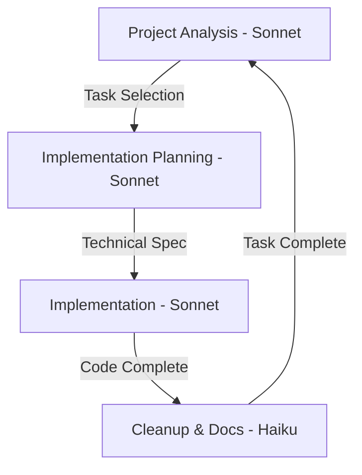

# Four-Phase Claude Development Workflow

> [!note] 
> Structured development workflow using distinct analysis, planning, implementation, and cleanup phases with Claude 3.5 Sonnet and Claude 3 Haiku.

## Development Flow


## Workflow Phases

### 1. Project Analysis (Sonnet)
**Purpose:** Select the next most valuable task to implement
**Input:** Project docs, GitHub issues, development status
**Output:** Task Analysis Document

> [!tip] Use [[examples/project-analysis-prompt|Project Analysis Prompt]]

Selection Criteria:
1. Priority status
2. Blocking status
3. Dependencies
4. Technical complexity
5. Value/effort ratio

### 2. Implementation Planning (Sonnet)
**Purpose:** Create detailed technical specification
**Input:** Task Analysis Document, coding standards
**Output:** Technical Specification Document

> [!tip] Use [[examples/implementation-plan-prompt|Implementation Plan Prompt]]

Planning Focus:
1. Technical design details
2. Interface definitions
3. Data flow changes
4. Test strategy
5. Migration steps

### 3. Implementation (Sonnet)
**Purpose:** Execute the technical specification
**Input:** Technical Specification Document, codebase
**Output:** Code Changes, Tests, Core Documentation

> [!tip] Use [[examples/implementation-prompt|Implementation Prompt]]

Implementation Steps:
1. Write tests
2. Create/update interfaces
3. Implement core changes
4. Verify success criteria
5. Add essential documentation

### 4. Cleanup & Documentation (Haiku)
**Purpose:** Clean up implementation and update documentation
**Input:** Completed implementation, codebase changes
**Output:** Clean codebase, updated documentation, closed issues

> [!tip] Use [[examples/cleanup-prompt|Cleanup Prompt]] and [[examples/doc-updates-prompt|Documentation Updates Prompt]]

Cleanup Steps:
1. Review project documentation
2. Remove debug code
3. Review/update tests
4. Add code comments
5. Update GitHub issues

## Phase Transitions

### Project Analysis → Implementation Planning
1. Complete task analysis document
2. Verify selection criteria considered
3. Confirm task priority and scope
4. Create new Sonnet chat for planning
5. Hand off analysis document

### Implementation Planning → Implementation
1. Complete technical specification
2. Verify all interfaces defined
3. Confirm test coverage plan
4. Create new Sonnet chat for implementation
5. Hand off technical spec

### Implementation → Cleanup
1. Verify core implementation complete
2. Basic tests passing
3. Essential documentation added
4. Create new Haiku chat for cleanup
5. Hand off implementation summary

### Cleanup → Next Analysis
1. Verify all success criteria met
2. Complete documentation updates
3. Close GitHub issues
4. Create new Sonnet chat for analysis
5. Start next task selection

## Document Templates

### Task Analysis Document
```markdown
TASK ANALYSIS
GitHub Issue: #[number] [title]
Labels: [high-priority, bug, feature, etc]
Description: [1-2 sentences]
Priority: [High/Medium/Low] ([reasoning])
Current State: [1-2 sentences]

IMPLEMENTATION STEPS
1. [ ] [First step]
2. [ ] [Second step]
...

NEXT IMPLEMENTATION TASK
Description: [Clear description]
Files to Modify:
- [path]: [changes]
Files to Create:
- [path]: [purpose]

SUCCESS CRITERIA
- [ ] [criterion]
- [ ] [criterion]

TECHNICAL NOTES
- [technical detail]
- [technical detail]

FUTURE TASKS
- [ ] [future task]
- [ ] [future task]
```

### Technical Specification Document
```markdown
IMPLEMENTATION SPECIFICATION
Component: [name]
Issue: [reference]

TECHNICAL DESIGN
Data Flow:
- [flow point 1]
- [flow point 2]

Core Changes:
1. [Change Area 1]
   - Location: [file]
   - Details: [specifics]
   
2. [Change Area 2]
   - Location: [file]
   - Details: [specifics]

INTERFACES
[Interface definitions]

TEST PLAN
1. Unit Tests:
   - [test scenario]
   - [test scenario]
2. Integration Tests:
   - [test scenario]
   - [test scenario]

MIGRATION PLAN
1. [Step 1]
2. [Step 2]
```

### Documentation Update Report
```markdown
UPDATE REPORT
Component: [name]
Issue: [reference]

DOCUMENTATION CHANGES
Planning Updates:
1. [file]: [changes]
2. [file]: [changes]

GITHUB UPDATES
Closed Issues:
1. #[number]: [completion summary]
2. #[number]: [completion summary]

New Issues:
1. Title: [issue title]
   Labels: [labels]
   Description: [description]

CODE CLEANUP
Debug Removal:
1. [file]: [details]
2. [file]: [details]

TEST UPDATES
Modified Tests:
1. [test]: [changes]
2. [test]: [changes]

CODE COMMENTS
Updated Files:
1. [file]:
   ```[language]
   // Comment updates
   ```

COMMIT MESSAGE
type(scope): Brief description

- Change detail 1
- Change detail 2

Issue: #[number]
```

## Best Practices

### Chat Management
- Use new chat for each phase
- Clear phase transitions
- Keep context in handoff docs
- Link to GitHub issues

### Documentation
- Update docs during implementation
- Keep templates up to date
- Document decisions
- Note future tasks

### Testing
- Write tests first
- Cover edge cases
- Test error conditions
- Verify success criteria

### GitHub Integration
- Reference issues in commits
- Close completed issues
- Create follow-up issues
- Keep labels current

## Related Documents
- [[examples/project-analysis-prompt|Project Analysis Prompt]]
- [[examples/implementation-plan-prompt|Implementation Plan Prompt]]
- [[examples/implementation-prompt|Implementation Prompt]]
- [[examples/cleanup-prompt|Cleanup Prompt]]
- [[examples/doc-updates-prompt|Documentation Updates Prompt]]
- GitHub Repository: https://github.com/jerseycheese/BootHillGM
