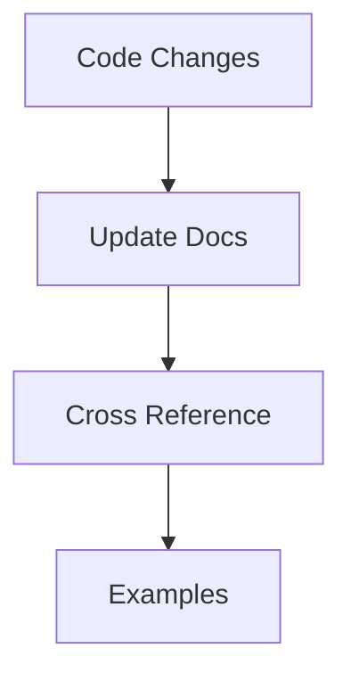

# Documentation Workflow

> [!note]
> Process for maintaining project documentation.

## Process


## Document Types
1. Component Documentation
2. Test Coverage
3. Usage Examples

## Templates

### Component
```markdown
# ComponentName

## Purpose
[Brief description]

## Props
[Interface details]

## Usage
[Code example]
```

### Feature
```markdown
# FeatureName

## Overview
[Description]

## Implementation
[Key points]

## Testing
[Coverage]
```
