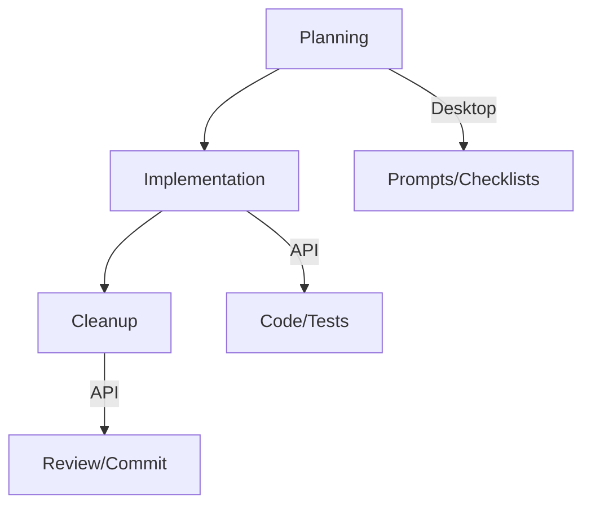

# Feature Development Workflow

> [!info]
> Core development workflow using Claude Desktop and API integration.

## Process

## Stages

### 1. Planning (Desktop)
- Review requirements
- Generate implementation prompt
- Create verification list

### 2. Implementation (API)
- Generate code/tests
- Document changes
- Initial verification

### 3. Cleanup (API)
- Fix issues
- Update docs
- Commit changes

## Examples
> [!example]
> See [[examples/weapon-combat|Weapon Combat Example]] for complete workflow

## Related
- [[prompt-guide|Prompt Writing Guide]]
- [[testing-workflow|Testing Workflow]]