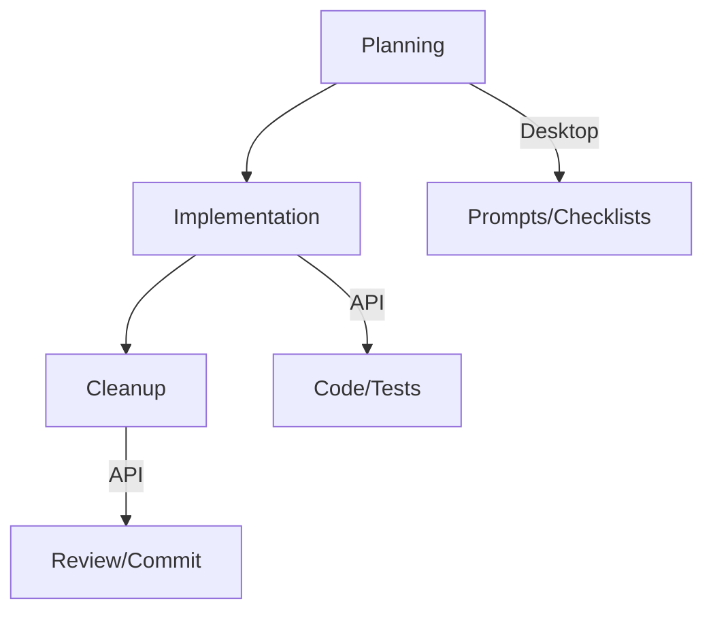

# Feature Development Workflow

> [!info]
> Core development workflow using Claude Desktop and API integration.

## Process

## Issue Tracking
All feature-related bugs and tasks are tracked in [GitHub Issues](https://github.com/jerseycheese/BootHillGM/issues). When working on features:
- Create related issues for bugs found
- Link commits to issues using #issue-number
- Use labels to categorize issues (feature, bug, enhancement)
- Close issues when resolved

## Stages

### 1. Planning (Desktop)
- Review requirements
- Generate implementation prompt
- Create verification list

### 2. Implementation (API)
- Generate code/tests
- Document changes
- Initial verification

### 3. Cleanup (API)
- Fix issues
- Update docs
- Commit changes

## Related
- [[prompt-guide|Prompt Writing Guide]]
- [[testing-workflow|Testing Workflow]]