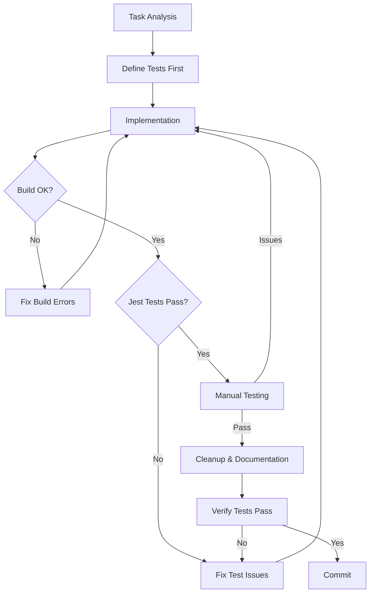

# Development Workflows

> [!note]
> Start here to understand development processes for BootHillGM.

## Core Workflows
- 🔄 [[feature-workflow|Feature Development]]
- 🧪 [[testing-workflow|Testing]]
- 📝 [[documentation-workflow|Documentation]]
- 🔧 [[claude-app-prompt-templates#component-refactoring|Refactoring Guide]]

## TDD with KISS Principles
- 🧠 [[tdd-with-kiss|Test-Driven Development with KISS]] - Recommended workflow
- 💡 [[kiss-principles-react|KISS Principles for React]] - Simplicity guidelines

## AI-Assisted Development
- 🤖 [[claude-app-workflow|Claude App Workflow]] - Primary development workflow
- 💬 [[claude-workflow|Claude Legacy Workflow]] - API-based workflow (legacy)
- ✍️ [[prompt-guide|Prompt Writing Guide]]

### Claude App Tools
- 🔄 [[claude-app-workflow-handoffs|Handoff Templates]]
- 🛠️ [[claude-app-mcp-optimization|MCP Optimization Guide]]
- 📝 [[claude-app-prompt-templates|Prompt Templates]]
- 📊 [[api-vs-app-comparison|API vs App Comparison]]

## Development Workflow Diagram

## Quick Reference Checklist

1. ✅ Define and write tests first
2. ✅ Implement simplest solution that passes tests
3. ✅ Fix build errors before running tests
4. ✅ Fix failing tests before manual testing
5. ✅ Cleanup only after all tests pass
6. ✅ Verify tests still pass after cleanup
7. ✅ Commit and close GitHub issue

## Further Reading
- [[../../technical-guides/contributing|Contributing Guide]]
- [[../../boot-hill-rules/index|Boot Hill Rules]]