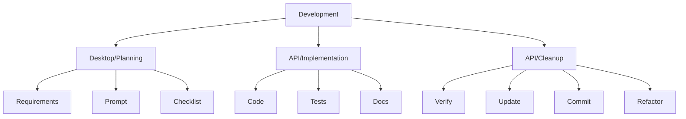

# Development Workflows

> [!note]
> Start here to understand development processes for BootHillGM.

## Core Workflows
- 🔄 [[feature-workflow|Feature Development]]
- 🧪 [[testing-workflow|Testing]]
- 📝 [[documentation-workflow|Documentation]]
- 🔧 [[examples/refactor-prompt|Refactoring Guide]]

## AI-Assisted Development
- 🤖 [[claude-workflow|Claude Workflow]] - Primary development workflow
- ✍️ [[prompt-guide|Prompt Writing Guide]]

## Quick Reference

## Further Reading
- [[../../technical-guides/contributing|Contributing Guide]]
- [[../../boot-hill-rules/index|Boot Hill Rules]]