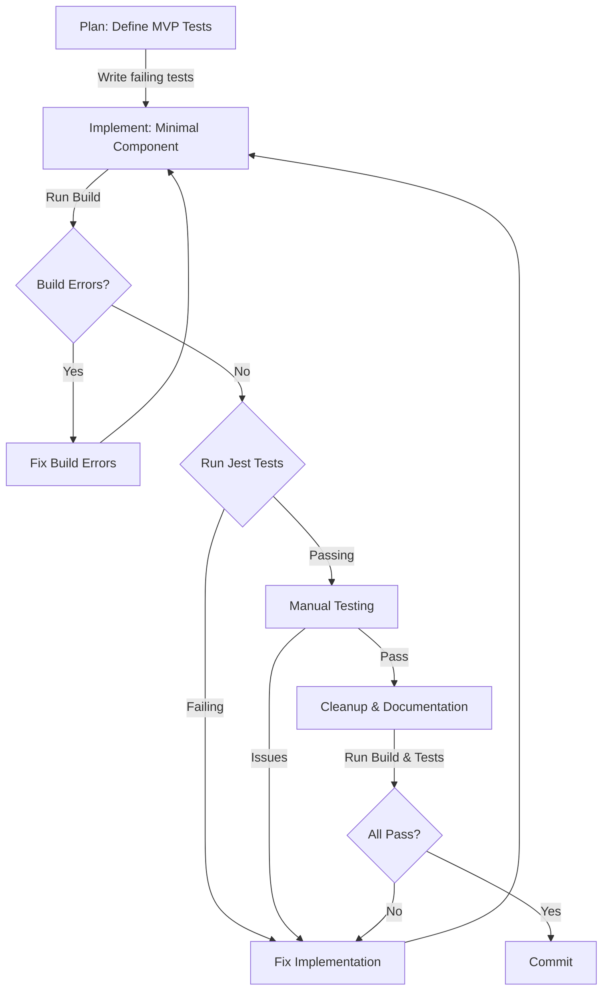

# Test-Driven Development with KISS Principles

> [!important] 
> This workflow emphasizes writing tests first, implementing to meet test expectations, and maintaining a "Keep It Simple, Stupid" approach throughout.

## Core Workflow Loop



## Key Principles

### Test-Driven Development (TDD)
- **Write tests first** that define expected behavior
- Implement the simplest code that makes tests pass
- Refactor for cleanliness without changing behavior

### Keep It Simple, Stupid (KISS)
- Start with the minimum viable implementation
- Avoid premature optimization
- Solve one problem at a time
- Prefer clarity over cleverness

### Iteration Over Perfection
- Expect multiple cycles through the build → test → fix loop
- Each iteration improves quality incrementally
- Feedback from each stage informs the next

## Workflow Breakdown

### 1. Planning: Define Tests First
Like Drupal's hook_requirements(), clearly define what "done" means before coding:
```javascript
// Example of writing tests first
test('Character sheet displays correct health value', () => {
  const sheet = render(<CharacterSheet health={50} maxHealth={100} />);
  expect(sheet.getByTestId('health-display')).toHaveTextContent('50/100');
});
```

### 2. Implementation: Minimal Viable Component
Similar to Drupal's theme hooks, implement just enough to meet the requirements:
```jsx
// Minimal implementation to pass the test
const CharacterSheet = ({ health, maxHealth }) => (
  <div data-testid="health-display">{health}/{maxHealth}</div>
);
```

### 3. Build → Test → Fix Loop
- **Fix build errors first** (like fixing PHP syntax errors in Drupal)
- **Run and fix Jest tests** (like SimpleTest in Drupal)
- **Manually test implementation** (like checking theme rendering)
- Repeat until all pass

### 4. Documentation & Cleanup
Only after all tests pass:
- Remove debugging code (console.logs)
- Update documentation
- Add inline comments for complex logic

## AI-Assisted Development Guidelines

When working with Claude or other AI assistants:

### Planning Prompts
```
Help me plan tests for a [component] that needs to [functionality].
Focus on core functionality only, using KISS principles.
```

### Implementation Prompts
```
I need a minimal implementation of [component] that will pass these tests:
[paste tests]

Keep it as simple as possible while meeting requirements.
```

### Debugging Prompts
```
I have these build errors or failing tests:
[paste errors]

Help me fix them with minimal changes to maintain simplicity.
```

## Mapping to Your Drupal Experience

| Drupal Concept | React Equivalent | Workflow Stage |
|----------------|------------------|----------------|
| hook_requirements() | Jest test expectations | Planning |
| theme_hook() | React component props interface | Planning |
| theme() implementation | React component function | Implementation |
| drupal_set_message() | console.log (temp during dev) | Implementation |
| SimpleTest | Jest component tests | Testing |
| Browser testing | Manual React testing | Verification |

## Related Docs
- [[claude-app-workflow|Claude App Workflow]]
- [[kiss-principles-react|KISS Principles for React]]
- [[testing-workflow|Testing Workflow]]