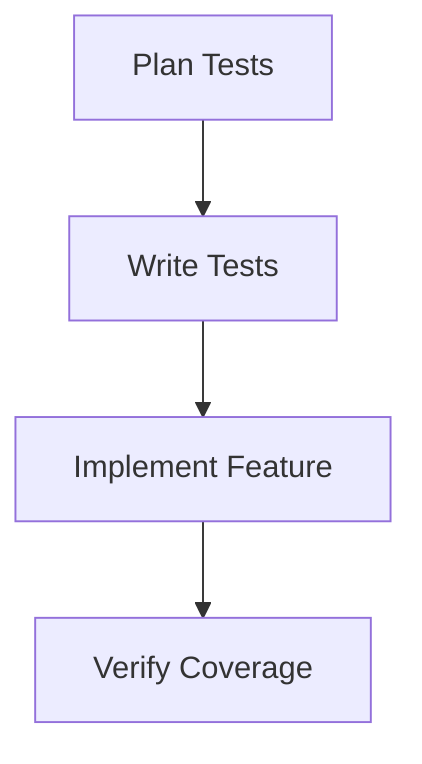

# Testing Workflow

> [!important]
> Test-driven development approach using Claude.

## Process Flow

## Claude Integration
1. Planning: Generate test cases
2. Implementation: Create tests with feature
3. Cleanup: Verify edge cases

## Test Types
- Unit: Component functionality
- Integration: System interaction
- Edge Cases: Error handling