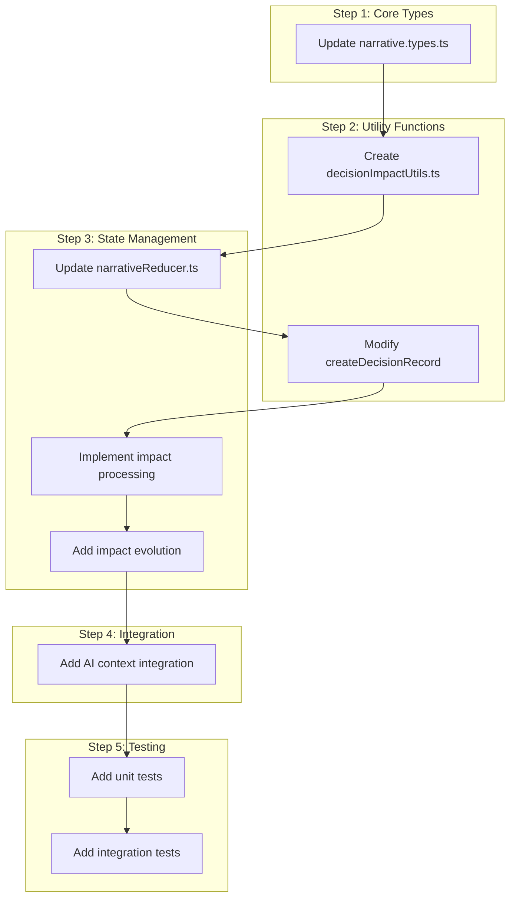
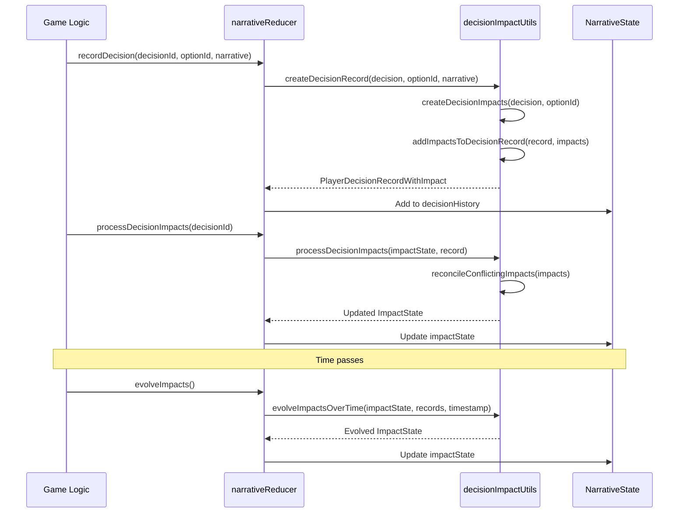
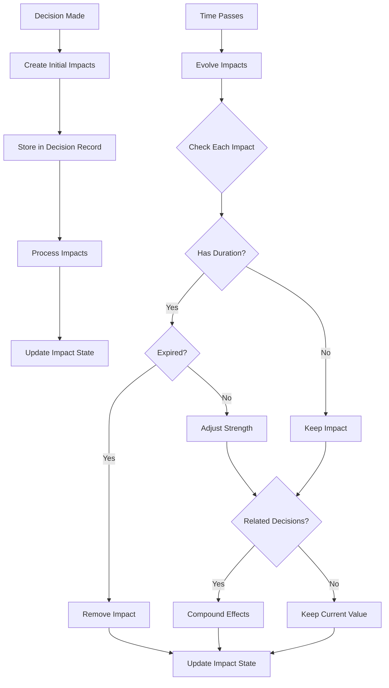

# Player Decision Impact Processing Implementation Plan

## Overview

This implementation plan outlines the approach for Phase 3 of the Player Decision Impact Processing system. Building on the foundation established in Phases 1 and 2, this phase will focus on processing player decisions and recording their impacts on the narrative, ensuring choices persist and matter in the game world.

## Current State Analysis

Based on the codebase review:

1. Phase 1 implemented the core data structures and state management:
    - Defined types like `PlayerDecision`, `PlayerDecisionOption`, `PlayerDecisionRecord`
    - Updated the narrative reducer to handle decision-related actions
    - Added basic decision tracking to the narrative state

2. Phase 2 implemented the decision extraction system:
    - Created utility functions in `decisionUtils.ts` for creating, recording, and filtering decisions
    - Implemented the response parser to extract decisions from AI responses
    - Added integration with the AI service

3. The current system can:
    - Present decision points to the player
    - Record the player's choices
    - Store the history of player decisions
    - Calculate basic relevance of decisions over time
    - Make decision history available for AI context

## Phase 3 Implementation Plan

### 1. Design the Impact Metadata Structure

We'll extend the existing `PlayerDecisionRecord` interface to include impact metadata:

```typescript
/**
 * Defines the type of impact a decision has on the game world
 */
export type DecisionImpactType = 
  | 'reputation'    // Impact on character's reputation
  | 'relationship'  // Impact on relationship with NPCs
  | 'story-arc'     // Impact on story progression
  | 'world-state'   // Impact on the game world state
  | 'character'     // Impact on character development
  | 'inventory';    // Impact on items/resources

/**
 * Defines the severity of a decision impact
 */
export type ImpactSeverity =
  | 'major'     // Significant, long-lasting impact
  | 'moderate'  // Medium-level impact
  | 'minor';    // Small, possibly temporary impact

/**
 * Defines a single impact of a player decision
 */
export interface DecisionImpact {
  id: string;
  type: DecisionImpactType;
  target: string;           // Entity affected (character name, location, etc.)
  severity: ImpactSeverity;
  description: string;      // Human-readable description
  value: number;            // Numeric value/magnitude (-10 to +10)
  duration?: number;        // Duration in milliseconds, undefined = permanent
  conditions?: string[];    // Conditions that might modify this impact
  relatedDecisionIds?: string[]; // IDs of related decisions
}

/**
 * Extended PlayerDecisionRecord with impact metadata
 */
export interface PlayerDecisionRecordWithImpact extends PlayerDecisionRecord {
  impacts: DecisionImpact[];
  processedForImpact: boolean; // Flag to track if impact processing has occurred
  lastImpactUpdate: number;    // Timestamp of last impact update
}
```

### 2. Update Narrative Context with Impact State

Add a new section to the `NarrativeContext` to track the accumulated impacts:

```typescript
/**
 * Represents the accumulated state of decision impacts
 */
export interface ImpactState {
  reputationImpacts: Record<string, number>; // Character -> reputation value
  relationshipImpacts: Record<string, Record<string, number>>; // Character -> Target -> value
  worldStateImpacts: Record<string, any>; // Key -> value for world state changes
  storyArcImpacts: Record<string, number>; // Story arc ID -> progression value
  lastUpdated: number; // Timestamp of last update
}

/**
 * Extended NarrativeContext with impact state
 */
export interface NarrativeContextWithImpact extends NarrativeContext {
  impactState: ImpactState;
}
```

### 3. Implement Decision Impact Utilities

Create a new utility file `decisionImpactUtils.ts` with functions for working with decision impacts:

```typescript
/**
 * Creates impact objects for a decision record
 */
export function createDecisionImpacts(
  decision: PlayerDecision,
  selectedOptionId: string
): DecisionImpact[];

/**
 * Updates a decision record with impact information
 */
export function addImpactsToDecisionRecord(
  record: PlayerDecisionRecord,
  impacts: DecisionImpact[]
): PlayerDecisionRecordWithImpact;

/**
 * Processes decision impacts and updates the impact state
 */
export function processDecisionImpacts(
  impactState: ImpactState,
  decisionRecord: PlayerDecisionRecordWithImpact
): ImpactState;

/**
 * Updates impact values based on time passed and other factors
 */
export function evolveImpactsOverTime(
  impactState: ImpactState,
  decisionRecords: PlayerDecisionRecordWithImpact[],
  currentTimestamp: number
): ImpactState;

/**
 * Resolves conflicts between impacts affecting the same target
 */
export function reconcileConflictingImpacts(
  impacts: DecisionImpact[]
): DecisionImpact[];

/**
 * Formats impact information for inclusion in AI context
 */
export function formatImpactsForAIContext(
  impactState: ImpactState,
  maxEntries: number = 5
): string;
```

### 4. Update Narrative Reducer

Extend the narrative reducer to handle impact-related actions:

```typescript
// Add new action types
export type NarrativeActionType =
  // Existing actions...
  | 'PROCESS_DECISION_IMPACTS'
  | 'UPDATE_IMPACT_STATE'
  | 'EVOLVE_IMPACTS';

export type NarrativeAction =
  // Existing actions...
  | { type: 'PROCESS_DECISION_IMPACTS'; payload: string } // decisionId
  | { type: 'UPDATE_IMPACT_STATE'; payload: Partial<ImpactState> }
  | { type: 'EVOLVE_IMPACTS' };

// Add reducer cases
case 'PROCESS_DECISION_IMPACTS': {
  // Implementation
}

case 'UPDATE_IMPACT_STATE': {
  // Implementation
}

case 'EVOLVE_IMPACTS': {
  // Implementation
}

// Add action creators
export const processDecisionImpacts = (decisionId: string): NarrativeAction => ({
  type: 'PROCESS_DECISION_IMPACTS',
  payload: decisionId,
});

export const updateImpactState = (
  impactStateUpdate: Partial<ImpactState>
): NarrativeAction => ({
  type: 'UPDATE_IMPACT_STATE',
  payload: impactStateUpdate,
});

export const evolveImpacts = (): NarrativeAction => ({
  type: 'EVOLVE_IMPACTS',
});
```

### 5. Implementation Sequence



### 6. Decision Impact Processing Flow



### 7. Impact Evolution System



## Testing Strategy

### Unit Tests

1. **Type Tests**:
   - Test the new type definitions and interfaces
   - Ensure proper type checking for impact-related structures

2. **Utility Function Tests**:
   - Test each function in `decisionImpactUtils.ts`
   - Test edge cases like empty impacts, conflicting impacts, etc.

3. **Reducer Tests**:
   - Test the new reducer actions and state updates
   - Verify proper state transitions for impact processing

### Integration Tests

1. **Decision Flow Tests**:
   - Test the complete flow from decision creation to impact processing
   - Verify impacts are correctly stored and processed

2. **Impact Evolution Tests**:
   - Test how impacts evolve over time
   - Verify expiration and strength adjustments work correctly

3. **AI Context Tests**:
   - Test that impact information is correctly formatted for AI context
   - Verify the AI receives the proper impact context

### Test File Structure

```
/app/__tests__/
  /decisionImpactUtils.test.ts     - Unit tests for impact utilities
  /narrative.types.test.ts         - Update with tests for new types
  /narrativeReducer.test.ts        - Update with tests for new actions
  /playerDecisionImpact.test.ts    - Integration tests for impact system
```

## Implementation Details

### 1. Extending the Decision Record Creation

```typescript
// Update createDecisionRecord in decisionUtils.ts
export function createDecisionRecord(
  decision: PlayerDecision,
  selectedOptionId: string,
  narrative: string
): PlayerDecisionRecordWithImpact {
  // Existing implementation...
  
  // Create impacts based on the selected option
  const impacts = createDecisionImpacts(decision, selectedOptionId);
  
  return {
    // Existing fields...
    impacts,
    processedForImpact: false,
    lastImpactUpdate: Date.now()
  };
}
```

### 2. Processing Decision Impacts

```typescript
// In decisionImpactUtils.ts
export function processDecisionImpacts(
  impactState: ImpactState,
  decisionRecord: PlayerDecisionRecordWithImpact
): ImpactState {
  if (decisionRecord.processedForImpact) {
    return impactState;
  }
  
  const newImpactState = { ...impactState };
  
  // Process each impact and update the impact state
  for (const impact of decisionRecord.impacts) {
    switch (impact.type) {
      case 'reputation':
        // Update reputation impacts
        break;
      case 'relationship':
        // Update relationship impacts
        break;
      // Handle other impact types...
    }
  }
  
  return {
    ...newImpactState,
    lastUpdated: Date.now()
  };
}
```

### 3. Evolving Impacts Over Time

```typescript
// In decisionImpactUtils.ts
export function evolveImpactsOverTime(
  impactState: ImpactState,
  decisionRecords: PlayerDecisionRecordWithImpact[],
  currentTimestamp: number
): ImpactState {
  const newImpactState = { ...impactState };
  
  // Process each decision record to evolve its impacts
  for (const record of decisionRecords) {
    // Skip records that haven't been processed yet
    if (!record.processedForImpact) {
      continue;
    }
    
    // Calculate time elapsed since last update
    const timeElapsed = currentTimestamp - record.lastImpactUpdate;
    
    // Evolve each impact based on time elapsed and other factors
    // ...
  }
  
  return {
    ...newImpactState,
    lastUpdated: currentTimestamp
  };
}
```

## Conclusion

This implementation plan provides a comprehensive approach to implementing Phase 3 of the Player Decision Impact Processing system. By following this plan, we will create a robust system that:

1. Records player decisions with associated impact metadata
2. Persists decision impacts in the narrative state
3. Updates narrative context based on decision impacts
4. Allows impacts to evolve over time
5. Integrates with the AI system to influence future narrative content

The implementation follows an MVP approach while ensuring all requirements are met. The modular design allows for future enhancements and extensions.