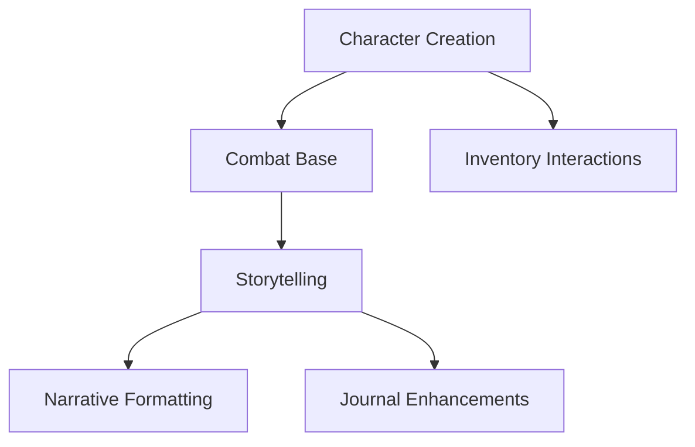

# Features Overview

This Map of Content (MOC) provides a comprehensive overview of all features in BootHillGM, both current and completed.

## Current Development
### Active Features
- [[_current/narrative-formatting|Narrative Formatting]] - Enhanced text display and formatting
- [[_current/inventory-interactions|Inventory Interactions]] - Advanced inventory management
- [[_current/journal-enhancements|Journal Enhancements]] - Improved journal functionality

### Implementation Status
| Feature | Status | Priority | Dependencies |
|---------|---------|-----------|--------------|
| Narrative Formatting | In Progress | High | AI Integration |
| Inventory Interactions | In Progress | Medium | State Management |
| Journal Enhancements | In Progress | Medium | Core Systems |

## Completed Features
### Core Gameplay
- [[_completed/character-creation|Character Creation]] - Character generation system
- [[_completed/combat-base|Combat Base]] - Foundational combat mechanics
- [[_completed/storytelling|Storytelling]] - Basic narrative generation

### Feature Relationships

## Development Metrics
- Completed Features: 3
- Features in Development: 3

## Integration Points
### Core Systems
- [[../core-systems/combat-system|Combat System]]
- [[../core-systems/journal-system|Journal System]]
- [[../core-systems/state-management|State Management]]

### Technical Implementation
- [[../architecture/component-structure|Component Structure]]
- [[../technical-guides/testing|Testing Guide]]

## Feature Planning
- [[../planning/roadmap|Development Roadmap]]
- [[../meta/game-design|Game Design Document]]

## Quality Assurance
- Feature Testing Status: [[../technical-guides/testing|Testing Guide]]
