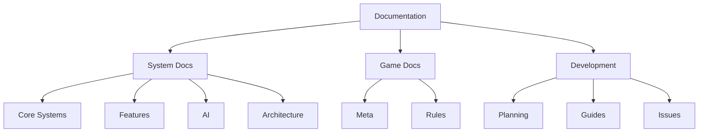

# Boot Hill GM Documentation

## Overview
This documentation serves as the central knowledge base for the Boot Hill GM project, covering system architecture, game rules, development processes, and AI integration.

## Purpose
The documentation aims to:
- Provide comprehensive technical references for developers
- Maintain consistent game rules and mechanics
- Document architectural decisions and implementation details
- Support onboarding of new contributors

# Boot Hill GM Documentation

> [!note]
> This documentation uses Obsidian for optimal viewing. Maps of Content (MOC) are available for each major section.

## Quick Navigation
- 🎮 [[../meta/project-overview|Project Overview]]
- 📋 [[../planning/roadmap|Development Roadmap]]
- 🔧 [[../technical-guides/setup|Development Setup]]
- ❗ [GitHub Issues](https://github.com/jerseycheese/BootHillGM/issues)

## System Documentation
### Core Systems
> [[core-systems/_index|Core Systems Overview]]
- [[core-systems/combat-system|Combat System]]
- [[core-systems/state-management|State Management]]
- [[core-systems/journal-system|Journal System]]
- [[core-systems/combat-modifiers|Combat Modifiers]]

### Features
> [[features/_index|Features Overview]]
- 🚧 **In Development**
  - [[features/_current/narrative-formatting|Narrative Formatting]]
  - [[features/_current/inventory-interactions|Inventory Interactions]]
  - [[features/_current/journal-enhancements|Journal Enhancements]]
- ✅ **Completed**
  - [[features/_completed/character-creation|Character Creation]]
  - [[features/_completed/combat-base|Combat Base]]
  - [[features/_completed/storytelling|Storytelling]]

### AI Integration
> [[ai/_index|AI Systems Overview]]
- [[ai/game-master-logic|Game Master Logic]]
- [[ai/gemini-integration|Gemini Integration]]
- [[reference/gemini-api-guide|Gemini API Guide]]
- [[ai/prompt-engineering/core-prompts|Core Prompts]]

### Technical Architecture
> [[architecture/_index|Architecture Overview]]
- [[architecture/architecture-decisions|Architecture Decisions]]
- [[architecture/component-structure|Component Structure]]
- [[architecture/api-integration|API Integration]]

## Game Documentation
### Meta
- [[meta/game-design|Game Design Document]]
- [[meta/project-overview|Project Overview]]
- [[meta/claude-context/goals|Project Goals]]

### Boot Hill Rules
- [[boot-hill-rules/game-overview|Game Overview]]
- [[boot-hill-rules/combat-rules|Combat Rules]]
- [[boot-hill-rules/equipment|Equipment]]
- [[boot-hill-rules/weapons-chart|Weapons Chart]]

## Development
### Workflows
> [[development/workflows/index|Development Workflows]]
- [[development/workflows/feature-workflow|Feature Development]]
- [[development/workflows/claude-workflow|AI Development]]
- [[development/workflows/examples/weapon-combat|Example: Weapon Combat]]

---

