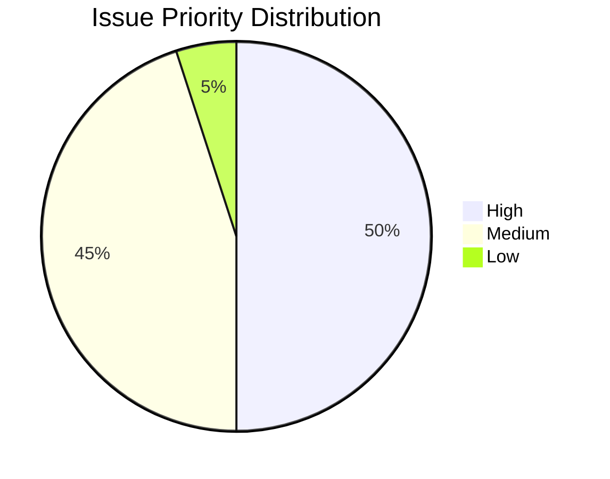
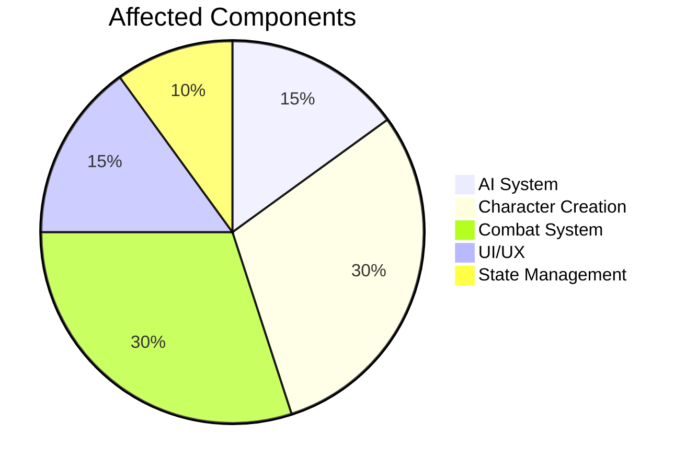

# BootHillGM Open Bugs

## Overview
This document tracks all currently open bugs in the BootHillGM project, providing detailed information about each issue including reproduction steps, expected behavior, and current status.

## Purpose
The purpose of this documentation is to:
- Provide a centralized reference for all open issues
- Facilitate bug triage and prioritization
- Track progress on issue resolution
- Serve as a communication tool between development and QA teams

## Related Documentation
- [[../closed-issues|Closed Issues]]
- [[../development/test-strategy|Test Strategy]]
- [[../core-systems/_index|Core Systems]]

This document tracks bugs found during development and testing. Each bug entry should include a description, steps to reproduce, expected behavior, actual behavior, and current status.

## Open Bugs

### Detailed Bug List

[BUG-003] AI Pacing Issues
  - Description: AI advances the story too quickly, not adjusting for the current setting.
  - Steps to Reproduce: 
    1. Start a game session in different settings (e.g., busy saloon, desert travel).
    2. Observe AI responses to player actions.
  - Expected Behavior: Story progression should be slower in busy locations and faster in travel scenarios.
  - Actual Behavior: Story progresses at the same pace regardless of setting.
  - Status: Open
  - Priority: Medium

[BUG-022] Generate Random Character Button Malfunction on Summary Page
  - Description: The Generate Random Character button doesn't generate a new character when clicked on the summary page.
  - Steps to Reproduce: 
    1. Go to the Character Creation page
    2. Click "Generate Random Character"
    3. On the summary page, click "Generate Random Character" again
  - Expected Behavior: A new random character should be generated and displayed
  - Actual Behavior: Only the instruction text is reloaded, no new character is generated
  - Status: Open
  - Priority: Medium

[BUG-023] Duplicate Inventory Items in Game Session
  - Description: Inventory items are loading twice in the Game Session.
  - Steps to Reproduce: 
    1. Start a game session
    2. Observe the inventory section
  - Expected Behavior: Inventory items should load once and display correctly
  - Actual Behavior: Inventory items are displayed twice
  - Status: Open
  - Priority: Medium

[BUG-024] Duplicate AI Text Generation in Character Creation
  - Description: The AI text for "Step 1" is generated twice, with the second version replacing the first.
  - Steps to Reproduce: 
    1. Go to the Create Character page
    2. Observe the AI text generation for "Step 1"
  - Expected Behavior: AI text should be generated once and displayed
  - Actual Behavior: AI text is generated twice, with visible replacement
  - Status: Open
  - Priority: Medium

[BUG-025] Unnecessary Reload of AI Messages on Generate Button Click
  - Description: Clicking the "Generate" button reloads all AI messages on the character creation page, including the step description.
  - Steps to Reproduce: 
    1. Go to the Create Character page
    2. Click the "Generate" button for any field
  - Expected Behavior: Only the field value should be generated, leaving the step description unchanged
  - Actual Behavior: Both the field value and step description are regenerated
  - Impact: Wastes API calls and creates unnecessary visual changes
  - Status: Open
  - Priority: Medium

[BUG-026] Character Creation Progress Not Saved During Process
  - Description: Character creation progress is not saved incrementally, risking loss of progress if page is refreshed
  - Steps to Reproduce: 
    1. Begin character creation
    2. Complete several steps
    3. Encounter an error or refresh the page
  - Expected Behavior: Progress should be saved after each step completion
  - Actual Behavior: Progress is lost on page refresh
  - Status: Open
  - Priority: High

[BUG-027] Incorrect Location Display in Game Session
  - Description: The location display sometimes includes more information than just the location name.
  - Steps to Reproduce: 
    1. Start a new game session
    2. Observe the location display in the status area
  - Expected Behavior: Only the location name should be displayed (e.g., "Dusty Crossroads")
  - Actual Behavior: Additional narrative text is included in the location display
  - Status: Open
  - Priority: Medium

[BUG-035] State Protection Timeout Handling
- Description: State protection utility sometimes triggers timeout too early during complex operations
- Steps to Reproduce:
  1. Enter combat with multiple opponents
  2. Perform rapid actions during combat
  3. Observe state update behavior
- Expected Behavior: Operations should complete before timeout
- Actual Behavior: Some operations timeout prematurely
- Status: Open
- Priority: High
- Impact: Combat System Reliability


[BUG-037] Unimplemented Combat Actions Not Disabled
  - Description: Aim/reload/move actions available but not implemented
  - Steps to Reproduce:
    1. Enter weapon combat
    2. Check action buttons
  - Expected Behavior: Unimplemented actions should be disabled
  - Actual Behavior: Actions appear clickable
  - Status: Open
  - Priority: Medium

[BUG-038] Infinite Strength Reduction Display
  - Description: StatusDisplay shows "-Infinity" strength after combat
  - Steps to Reproduce:
    1. Lose weapon combat
    2. Check StatusDisplay
  - Expected Behavior: Show actual strength reduction
  - Actual Behavior: Shows "chest-Infinity STR"
  - Status: Open
  - Priority: High

[BUG-039] Abrupt Combat UI Closure
  - Description: Combat UI disappears immediately when combat ends
  - Steps to Reproduce:
    1. Enter combat
    2. Continue until someone reaches 0 strength
  - Expected Behavior: Combat UI stays with summary, closeable by user
  - Actual Behavior: UI disappears instantly
  - Status: Open
  - Priority: High

[BUG-040] Incorrect Brawling Combat End State
  - Description: Combat ends prematurely with incorrect strength value
  - Steps to Reproduce:
    1. Enter brawling combat
    2. Fight until losing
  - Expected Behavior: Combat continues until 0 strength
  - Actual Behavior: Ends with strength at 7
  - Status: Open
  - Priority: High


[BUG-042] Inventory Use Button Non-Functional
  - Description: \"Use\" button no longer sends item usage message to narrative
  - Steps to Reproduce:
    1. Open inventory
    2. Click \"Use\" on any item
  - Expected Behavior: Item usage reflected in narrative
  - Actual Behavior: No narrative response
  - Status: Open
  - Priority: High

[BUG-043] Location State Inconsistency
  - Description: Location displays as \"Unknown Location\" despite being mentioned in narrative
  - Steps to Reproduce: 
    1. Start a game session
    2. Observe location header while reading narrative
  - Expected Behavior: Location header should match narrative location
  - Actual Behavior: Shows \"Unknown Location\" when location is known
  - Status: Open
  - Priority: High

[BUG-044] Missing Component CSS Classes
  - Description: Components lack consistent parent CSS classes for identification
  - Steps to Reproduce: 
    1. Inspect any component or page section
  - Expected Behavior: Each component should have identifying parent class
  - Actual Behavior: Components lack consistent class structure
  - Status: Open
  - Priority: Medium

[BUG-045] Repetitive AI Narrative Phrases
  - Description: AI frequently reuses specific phrases in narrative generation
  - Steps to Reproduce: 
    1. Play multiple game sessions
    2. Note repeated phrases like \"dust devils dance\"
  - Expected Behavior: Varied, natural narrative without obvious repetition
  - Actual Behavior: Certain phrases appear frequently
  - Status: Open
  - Priority: Medium

[BUG-046] Name Generation Default Value
  - Description: The first generated name's first name is always \"Caleb\"
  - Steps to Reproduce: 
    1. Go to character creation
    2. Generate a new name multiple times
  - Expected Behavior: First names should be randomly generated
  - Actual Behavior: First name is always \"Caleb\"
  - Status: Open
  - Priority: Low

[BUG-047] Name Generation Button Non-Functional
  - Description: The \"Generate\" button for Name field displays static text
  - Steps to Reproduce: 
    1. Go to character creation
    2. Click the \"Generate\" button for name field
  - Expected Behavior: Should generate a random name
  - Actual Behavior: Displays \"Generated Name\" instead
  - Status: Open
  - Priority: Medium

### Summary Table

| Bug ID   | Description | Priority | Status |
|----------|-------------|----------|--------|
| BUG-003  | AI Pacing Issues | Medium | Open |
| BUG-022  | Generate Random Character Button Malfunction | Medium | Open |
| BUG-023  | Duplicate Inventory Items | Medium | Open |
| BUG-024  | Duplicate AI Text Generation | Medium | Open |
| BUG-025  | Unnecessary Reload of AI Messages | Medium | Open |
| BUG-026  | Character Creation Progress Not Saved | High | Open |
| BUG-027  | Incorrect Location Display | Medium | Open |
| BUG-035  | State Protection Timeout Handling | High | Open |
| BUG-037  | Unimplemented Combat Actions | Medium | Open |
| BUG-038  | Infinite Strength Reduction Display | High | Open |
| BUG-039  | Abrupt Combat UI Closure | High | Open |
| BUG-040  | Incorrect Brawling Combat End State | High | Open |
| BUG-041  | Missing Opponent Default Weapon | High | Open |
| BUG-042  | Inventory Use Button Non-Functional | High | Open |
| BUG-043  | Location State Inconsistency | High | Open |
| BUG-044  | Missing Component CSS Classes | Medium | Open |
| BUG-045  | Repetitive AI Narrative Phrases | Medium | Open |
| BUG-046  | Name Generation Default Value | Low | Open |
| BUG-047  | Name Generation Button Non-Functional | Medium | Open |

## Issue Statistics

### Priority Distribution

```

### Component Distribution


## Notes
- Bugs should be triaged weekly to assess priority and status
- High priority bugs should be addressed within 1 sprint
- Medium priority bugs should be addressed within 2 sprints
- New bugs should follow the established documentation format
- Statistics are updated weekly to track project health
