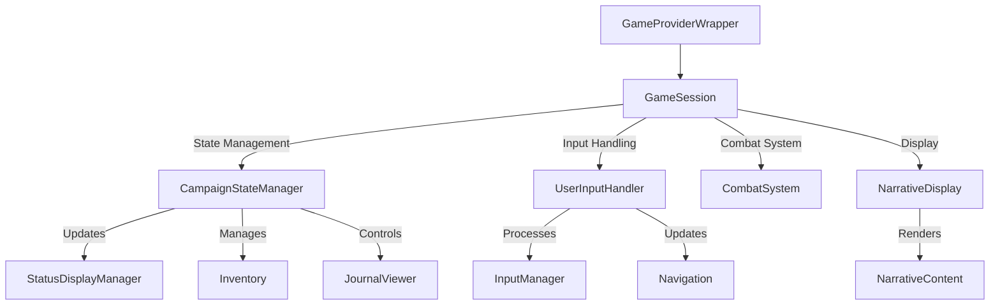

# Component Relationship Map

## Core Game Components

## Component Responsibilities

### State Management Layer
- **GameProviderWrapper**: Top-level component providing game context
- **CampaignStateManager**: Manages game state and progression
- **StatusDisplayManager**: Handles display of game status and player state

### User Interface Layer
- **InputManager**: Processes user inputs and commands
- **Navigation**: Manages game navigation and menu systems
- **NarrativeDisplay**: Handles story and narrative presentation
- **JournalViewer**: Displays game journal and player notes

### Game Systems
- **CombatSystem**: Manages combat mechanics and resolution
- **Inventory**: Handles item management and equipment
- **UserInputHandler**: Coordinates user interactions and game responses

## Key Integration Points

1. State Flow
   - GameProviderWrapper → CampaignStateManager → Individual Systems
   - Centralized state management through Campaign manager

2. User Input Pipeline
   - UserInputHandler → InputManager → Specific Systems
   - Coordinated input processing and response

3. Display Integration
   - NarrativeDisplay → Status Components
   - Coordinated update and render cycle

## Component Dependencies

### Direct Dependencies
- GameSession depends on all major subsystems
- CampaignStateManager is central to state updates
- UserInputHandler coordinates with all interactive components

### Shared Resources
- Game state context
- User input context
- Combat state
- Inventory state

## Implementation Notes

1. State Management:
   - Uses React Context for global state
   - CampaignStateManager handles state persistence
   - Component-specific state managed locally where appropriate

2. Event Flow:
   - UserInputHandler manages input event distribution
   - CampaignStateManager coordinates state updates
   - StatusDisplayManager handles UI updates

3. System Integration:
   - Combat system integration through CombatSystem component
   - Narrative system through NarrativeDisplay and Content
   - Inventory management through dedicated component
