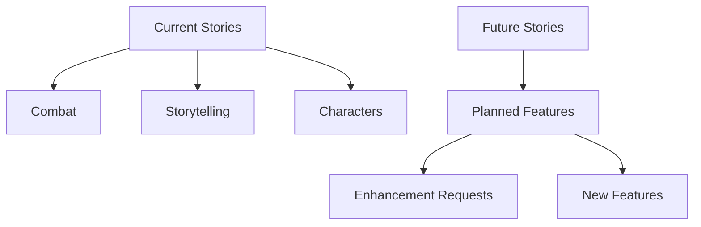

# Planning Overview

This Map of Content (MOC) provides a comprehensive overview of BootHillGM's development planning, requirements, and roadmap.

## Development Roadmap
- [[roadmap|Development Roadmap]] - Project timeline and milestones

## Requirements
### Current Development
- [[requirements/current-stories|Current User Stories]] - Active development items
- [[requirements/combat|Combat Requirements]] - Combat system specifications
- [[requirements/storytelling|Storytelling Requirements]] - Narrative system specs
- [[requirements/characters|Character Requirements]] - Character system specs

### Future Planning
- [[requirements/future-stories|Future User Stories]] - Planned features and enhancements

## Development Status

## Implementation Tracking
| Area | Status | Priority | Target |
|------|---------|-----------|---------|
| Combat System | In Progress | High | Q1 2024 |
| Storytelling | In Progress | High | Q1 2024 |
| Character System | Completed | Done | Q4 2023 |
| Inventory | Planned | Medium | Q2 2024 |

## Integration Points
### Core Systems
- [[../core-systems/combat-system|Combat System]]
- [[../core-systems/journal-system|Journal System]]
- [[../core-systems/state-management|State Management]]

### Features
- [[../features/_current/narrative-formatting|Narrative Formatting]]
- [[../features/_current/inventory-interactions|Inventory]]
- [[../features/_current/journal-enhancements|Journal]]

## Technical Implementation
- [[../architecture/component-structure|Component Structure]]
- [[../technical-guides/testing|Testing Guide]]
- [[../technical-guides/deployment|Deployment Guide]]

## Related Documentation
- [[../meta/project-overview|Project Overview]]
- [[../meta/game-design|Game Design Document]]
- [[../issues/open-issues|Open Issues]]