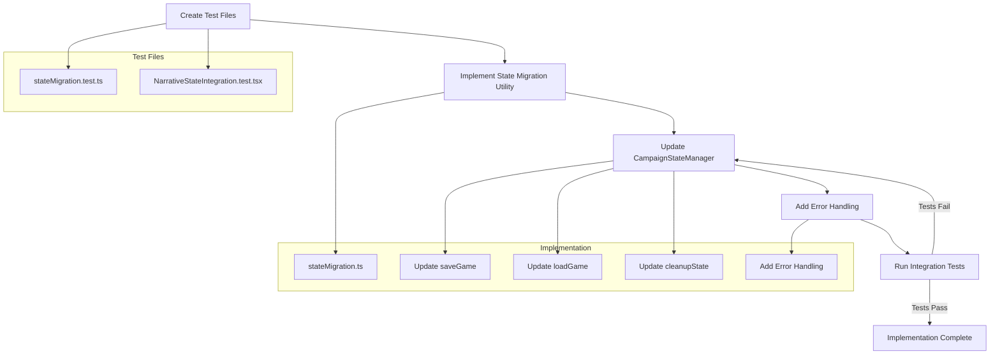

# Implementation Plan: Integrate Narrative State with Campaign State Manager

## Current State Analysis

The narrative state system has been implemented with types and a reducer, but it's not fully integrated with the CampaignStateManager for saving/loading. There is some partial integration:

- The `initialNarrativeState` is imported in CampaignStateManager
- There's an auto-save effect for narrative changes (lines 98-120)
- The narrative state is initialized during game cleanup (lines 252-262)

However, there are gaps in the full integration that need to be addressed.

## Implementation Plan

### 1. Test-Driven Development Setup

First, we'll create test files to guide our implementation:

1. Create a new test file `BootHillGMApp/app/__tests__/utils/stateMigration.test.ts` for testing the state migration utility
2. Create a new test file `BootHillGMApp/app/__tests__/components/NarrativeStateIntegration.test.tsx` for testing the narrative state integration with CampaignStateManager

### 2. State Migration Utility Implementation

Create a new utility file for handling state migrations:

1. Create `BootHillGMApp/app/utils/stateMigration.ts`
2. Implement functions to:
    - Detect missing narrative state in saved games
    - Add default narrative state to existing saves
    - Handle any necessary transformations for narrative state compatibility

### 3. CampaignStateManager Modifications

Update the CampaignStateManager to fully integrate narrative state:

1. Modify the `saveGame` function to properly handle narrative state serialization
2. Update the `loadGame` function to restore narrative state with proper validation
3. Ensure the `cleanupState` function properly resets narrative state
4. Add error handling for narrative state operations

### 4. Integration Testing

Implement comprehensive tests to verify:

1. Narrative state is properly saved to localStorage
2. Narrative state is correctly restored when loading a saved game
3. Existing saves are migrated correctly
4. Error handling works as expected

## Implementation Flow Diagram

## Success Criteria

The implementation will be considered successful when:

- ✅ All tests pass
- ✅ Narrative state is properly saved to localStorage
- ✅ Narrative state is correctly restored when loading a saved game
- ✅ Narrative state is properly initialized during game startup
- ✅ Narrative state is properly reset when cleaning up the game state
- ✅ Existing save files are correctly migrated to include narrative state
- ✅ Type safety is maintained between the narrative and campaign state systems
- ✅ Error handling is in place for narrative state operations