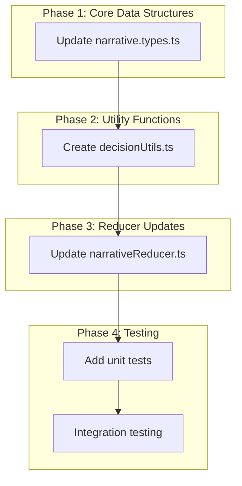
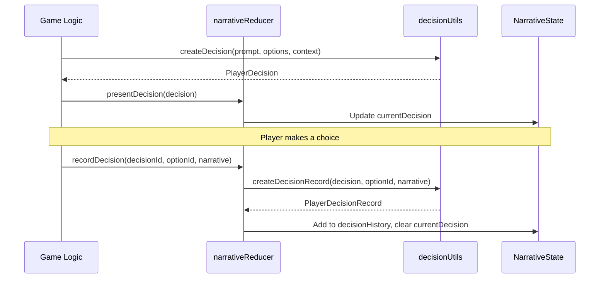
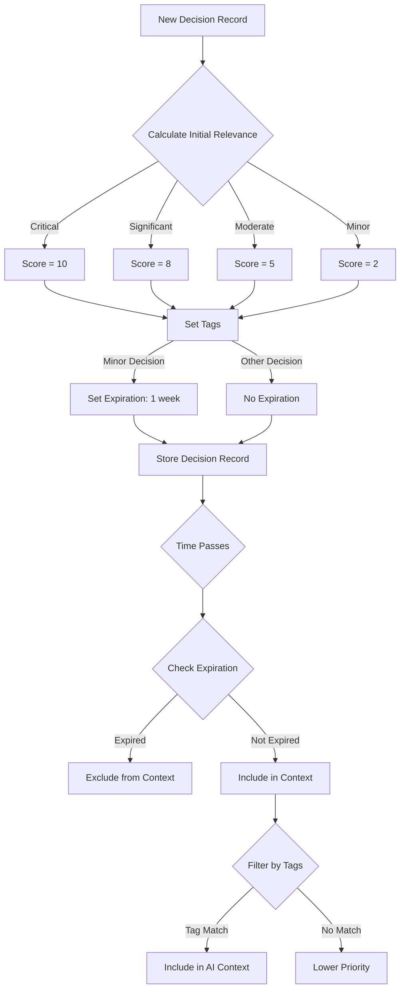

# Player Decision Tracking System Implementation Plan

## Overview

The Player Decision Tracking System is a core component of the narrative system in BootHillGM, designed to track and manage player decisions throughout the game. This system will enable the game to remember player choices, calculate their relevance over time, and use this information to influence future narrative content.

## Current State Analysis

From examining the codebase, I can see that:

1. The narrative system already has a robust foundation with `NarrativeState`, `NarrativeContext`, and related types.
2. The system currently tracks basic player choices via `selectedChoice` and `playerChoices` in the `NarrativeContext`.
3. The `narrativeReducer` handles various narrative actions but lacks specific decision tracking functionality.
4. The system has story progression tracking but needs enhanced decision impact tracking.

## Implementation Plan

### Phase 1: Core Data Structures and State Management

#### 1. Update Narrative Types

First, we'll implement the `PlayerDecision` interface and related types in `narrative.types.ts`:

```typescript
/**
 * Defines the importance level of a player decision
 */
export type DecisionImportance = 
  | 'critical'    // Major story-affecting decision
  | 'significant' // Important but not story-changing decision
  | 'moderate'    // Medium-impact decision
  | 'minor';      // Small or flavor decision

/**
 * Defines a single option in a player decision
 */
export interface PlayerDecisionOption {
  id: string;
  text: string;
  impact: string;
  tags?: string[];
}

/**
 * Defines a decision point presented to the player
 */
export interface PlayerDecision {
  id: string;
  prompt: string;
  timestamp: number;
  location?: LocationType;
  options: PlayerDecisionOption[];
  context: string;
  importance: DecisionImportance;
  characters?: string[];
  aiGenerated: boolean;
}

/**
 * Defines a record of a player's decision
 */
export interface PlayerDecisionRecord {
  decisionId: string;
  selectedOptionId: string;
  timestamp: number;
  narrative: string;
  impactDescription: string;
  tags: string[];
  relevanceScore: number;
  expirationTimestamp?: number;
}
```

#### 2. Update NarrativeContext and NarrativeState

Next, we'll update the `NarrativeContext` and `NarrativeState` interfaces to include decision tracking:

```typescript
export interface NarrativeContext {
  // Existing properties...
  
  // New properties for decision tracking
  activeDecision?: PlayerDecision;
  pendingDecisions: PlayerDecision[];
  decisionHistory: PlayerDecisionRecord[];
}

export interface NarrativeState {
  // Existing properties...
  
  // New property for current decision
  currentDecision?: PlayerDecision;
}
```

#### 3. Add New Action Types

Add new action types for decision tracking:

```typescript
export type NarrativeActionType =
  // Existing actions...
  | 'PRESENT_DECISION'         // New action for presenting a decision
  | 'RECORD_DECISION'          // New action for recording a decision
  | 'CLEAR_CURRENT_DECISION';  // New action for clearing the current decision

export type NarrativeAction =
  // Existing actions...
  
  // New actions for decision tracking
  | { type: 'PRESENT_DECISION'; payload: PlayerDecision }
  | { type: 'RECORD_DECISION'; payload: { decisionId: string; selectedOptionId: string; narrative: string } }
  | { type: 'CLEAR_CURRENT_DECISION' };
```

### Phase 2: Decision Utility Functions

Create a new utility file `decisionUtils.ts` with functions for working with player decisions:

```typescript
/**
 * Utility functions for working with player decisions
 */
import { v4 as uuidv4 } from 'uuid';
import { 
  PlayerDecision, 
  PlayerDecisionOption, 
  PlayerDecisionRecord,
  DecisionImportance,
  LocationType
} from '../types/narrative.types';

/**
 * Creates a new player decision with default values
 */
export function createDecision(
  prompt: string,
  options: PlayerDecisionOption[],
  context: string,
  importance: DecisionImportance = 'moderate',
  location?: LocationType,
  characters: string[] = []
): PlayerDecision {
  // Implementation
}

/**
 * Creates a decision option with default values
 */
export function createDecisionOption(
  text: string,
  impact: string,
  tags: string[] = []
): PlayerDecisionOption {
  // Implementation
}

/**
 * Creates a decision record when a player makes a choice
 */
export function createDecisionRecord(
  decision: PlayerDecision,
  selectedOptionId: string,
  narrative: string
): PlayerDecisionRecord {
  // Implementation
}

/**
 * Formats decision history for inclusion in AI context
 */
export function formatDecisionsForAIContext(
  decisions: PlayerDecisionRecord[],
  maxDecisions: number = 5
): string {
  // Implementation
}

/**
 * Checks if a decision has expired based on its expiration timestamp
 */
export function hasDecisionExpired(decision: PlayerDecisionRecord): boolean {
  // Implementation
}

/**
 * Filters decision history to only include relevant decisions
 */
export function filterRelevantDecisions(
  decisions: PlayerDecisionRecord[],
  currentTags: string[] = [],
  minRelevance: number = 0
): PlayerDecisionRecord[] {
  // Implementation
}
```

### Phase 3: Update Narrative Reducer

Update the `narrativeReducer.ts` file to handle the new decision-related actions:

```typescript
// Add these action creators to narrativeReducer.ts
export const presentDecision = (decision: PlayerDecision): NarrativeAction => ({
  type: 'PRESENT_DECISION',
  payload: decision,
});

export const recordDecision = (
  decisionId: string,
  selectedOptionId: string,
  narrative: string
): NarrativeAction => ({
  type: 'RECORD_DECISION',
  payload: { decisionId, selectedOptionId, narrative },
});

export const clearCurrentDecision = (): NarrativeAction => ({
  type: 'CLEAR_CURRENT_DECISION',
});

// Add these cases to the narrativeReducer switch statement
case 'PRESENT_DECISION': {
  return {
    ...state,
    currentDecision: action.payload,
  };
}

case 'RECORD_DECISION': {
  // Implementation
}

case 'CLEAR_CURRENT_DECISION': {
  return {
    ...state,
    currentDecision: undefined,
  };
}
```

## Implementation Sequence

Here's the sequence of implementation steps:



## Testing Strategy

We'll implement a comprehensive testing strategy:

1. **Unit Tests**:
   - Test each utility function in `decisionUtils.ts`
   - Test the new reducer actions and state updates
   - Test type guards and validation functions

2. **Integration Tests**:
   - Test the interaction between the decision system and the narrative context
   - Test persistence and loading of decision history
   - Test decision relevance calculations over time

3. **Edge Cases**:
   - Test handling of expired decisions
   - Test filtering with various tag combinations
   - Test handling of missing or invalid decision IDs

## Implementation Details

### 1. Decision Creation and Management



### 2. Decision Relevance Calculation



## Future Enhancements

After implementing the core decision tracking system, we can consider these enhancements:

1. **Decision Extraction from AI Responses**: Automatically identify decision points in AI-generated narrative.
2. **Dynamic Relevance Scoring**: Adjust relevance scores based on narrative context and player actions.
3. **Decision Visualization**: Create a UI component to visualize important past decisions.
4. **Decision Consequences**: Implement a more sophisticated system for tracking the long-term consequences of decisions.