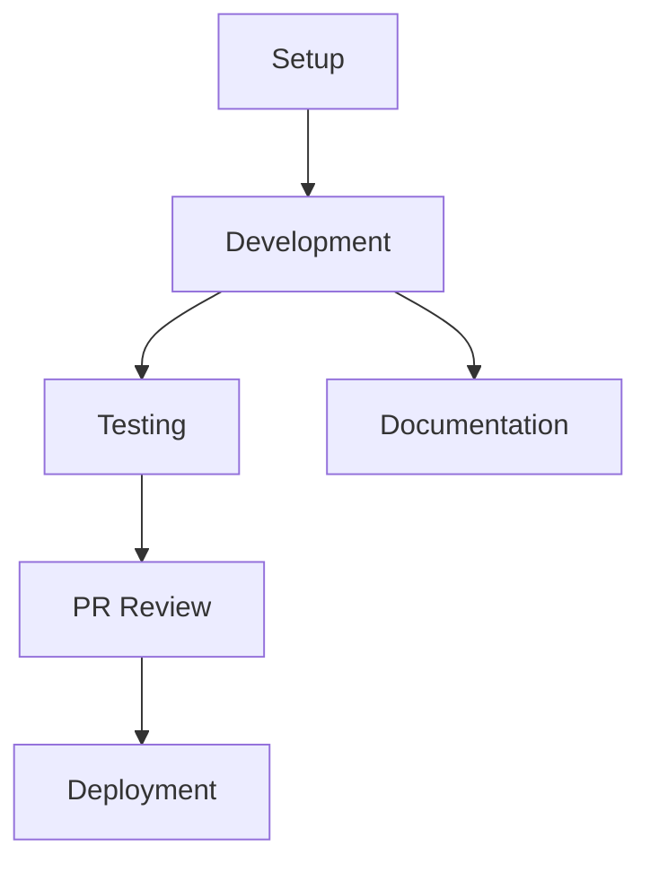

# Technical Guides Overview

This Map of Content (MOC) provides a comprehensive overview of technical guides and development documentation for BootHillGM.

## Development Setup
- [[./setup|Development Setup]] - Initial development environment setup
- [[./environment-configuration|Environment Configuration]] - Development environment setup
- [[./dependencies|Required Dependencies]] - Project dependencies
- [[./workflow|Development Workflow]] - Local development process

## Deployment
- [[deployment|Deployment Guide]] - Production deployment procedures
- Environment variables
- Build process
- Deployment verification

## Testing
- [[testing-guide|React Testing Guide]] - Comprehensive guide for testing React components
- [[component-testing|Component Testing]] - Testing React components of all types
- [[hook-testing|Hook Testing]] - Testing custom hooks and hook dependencies
- [[integration-testing|Integration Testing]] - Testing component interactions
- [[snapshot-testing|Snapshot Testing]] - Visual testing for UI components
- [[test-organization|Test Organization]] - Folder structure and test organization
- [[testing-workflow|Testing Workflow]] - Process guide for effective testing practices
- [[test-configuration|Test Configuration]] - Jest configuration and setup
- [[testing-overview|Testing Overview]] - High-level testing strategy

## Component Guidelines
- [[component-naming-convention|Component Naming Convention]] - Standards for component naming

## Contributing
- [[contributing|Contributing Guide]] - Contribution guidelines
- Code standards
- PR process
- Review guidelines

## Development Workflow

## Quick Reference
| Guide | Primary Use | Required |
|-------|-------------|-----------|
| Setup | Initial Dev | Yes |
| Testing | Component Quality | Yes |
| Deployment | Production | Yes |
| Contributing | Collaboration | Yes |

## Technical Stack
### Frontend
- Next.js 14
- React
- TypeScript
- Tailwind CSS

### Development Tools
- VS Code
- Jest
- React Testing Library
- MSW (Mock Service Worker)
- ESLint

## Integration Points
### Architecture
- [[../architecture/next-js-setup|Next.js Setup]]
- [[../architecture/component-structure|Component Structure]]
- [[../architecture/api-integration|API Integration]]

### Core Systems
- [[../core-systems/state-management|State Management]]
- [[../core-systems/ai-integration|AI Integration]]

## Best Practices
### Code Quality
- TypeScript usage
- Testing requirements
- Code style
- Documentation standards

### Performance
- Build optimization
- Runtime performance
- Testing performance
- Deployment efficiency

## Related Documentation
- [[../meta/project-overview|Project Overview]]
- [[../planning/roadmap|Development Roadmap]]
