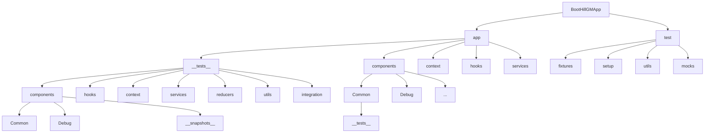

# Test Organization

## Overview

This guide explains the folder structure and organization patterns for tests in the BootHillGM project. A well-organized test structure makes tests easier to find, maintain, and run.

## Test Folder Structure

The BootHillGM project follows a structured approach to organizing test files, making it easy to locate and maintain tests as the codebase grows.

```
BootHillGMApp/
├── app/
│   ├── __tests__/                  # Main test directory for app-level tests
│   │   ├── components/             # Tests for components
│   │   │   ├── Common/             # Tests for common components
│   │   │   ├── Debug/              # Tests for debug components
│   │   │   ├── __snapshots__/      # Snapshot files
│   │   │   └── ...                 # Individual component tests
│   │   ├── hooks/                  # Tests for custom hooks
│   │   ├── context/                # Tests for context providers
│   │   ├── services/               # Tests for services
│   │   │   ├── ai/                 # Tests for AI services
│   │   │   └── ...                 # Other service tests
│   │   ├── reducers/               # Tests for reducers
│   │   ├── utils/                  # Tests for utility functions
│   │   └── integration/            # Integration tests
│   ├── components/                 # Component source files
│   │   ├── Common/                 # Shared components
│   │   │   ├── __tests__/          # Co-located tests (alternative approach)
│   │   │   └── ...                 # Component files
│   │   └── ...                     # Other component directories
│   ├── context/                    # Context providers
│   │   ├── __tests__/              # Co-located context tests
│   │   └── ...                     # Context files
│   └── ...                         # Other app directories
├── test/                           # Test utilities and shared resources
│   ├── fixtures/                   # Test data fixtures
│   │   ├── characters.ts           # Character data fixtures
│   │   ├── combat.ts               # Combat data fixtures
│   │   └── ...                     # Other fixtures
│   ├── setup/                      # Test setup files
│   │   ├── jest.setup.js           # Jest setup file
│   │   └── ...                     # Other setup files
│   ├── utils/                      # Test utilities
│   │   ├── renderWithContext.tsx   # Context wrapper for tests
│   │   ├── mockComponents.tsx      # Common component mocks
│   │   └── ...                     # Other test utilities
│   └── mocks/                      # Mock data and services
│       ├── api.ts                  # API mocks
│       ├── localStorage.ts         # localStorage mock
│       └── ...                     # Other mocks
└── ...                             # Other project directories
```

## Visual Test Structure



## Naming Conventions

### Test File Naming

The BootHillGM project uses consistent naming patterns for test files:

1. **Component Tests**: `ComponentName.test.tsx`
2. **Hook Tests**: `useHookName.test.ts`
3. **Utility Tests**: `utilityName.test.ts`
4. **Integration Tests**: `FeatureName.test.tsx`
5. **Snapshot Tests**: `ComponentName.snap.test.tsx`

### Test Group Naming

Use descriptive group names in `describe` blocks:

```typescript
// Component test
describe('Button component', () => {
  // Tests...
});

// Hook test
describe('useCounter hook', () => {
  // Tests...
});

// Integration test
describe('Inventory and Equipment Integration', () => {
  // Tests...
});
```

### Test Case Naming

Test case names should clearly describe what they're testing:

```typescript
// ❌ Bad: Vague test names
it('works correctly', () => {});
it('handles the case', () => {});

// ✅ Good: Descriptive test names
it('renders with default props', () => {});
it('increments counter when plus button is clicked', () => {});
it('shows error message for invalid inputs', () => {});
```

## Test Organization Patterns

### 1. Group by Feature

When testing complex features, group related tests together:

```typescript
describe('Character Creation', () => {
  describe('Name Input', () => {
    it('accepts valid character names', () => {});
    it('shows error for names that are too short', () => {});
    it('shows error for reserved names', () => {});
  });
  
  describe('Attribute Allocation', () => {
    it('allows increasing attributes up to maximum points', () => {});
    it('prevents decreasing attributes below minimum value', () => {});
    it('calculates remaining points correctly', () => {});
  });
  
  describe('Form Submission', () => {
    it('requires all mandatory fields before submitting', () => {});
    it('sends character data in the correct format', () => {});
    it('shows success message after successful submission', () => {});
  });
});
```

### 2. Setup and Teardown

Use `beforeEach`, `afterEach`, `beforeAll`, and `afterAll` to organize test setup and cleanup:

```typescript
describe('GameProvider', () => {
  // Setup before all tests
  beforeAll(() => {
    jest.useFakeTimers();
  });
  
  // Setup before each test
  beforeEach(() => {
    // Reset mocks or state
    localStorage.clear();
    mockApi.reset();
  });
  
  // Cleanup after each test
  afterEach(() => {
    jest.clearAllMocks();
  });
  
  // Cleanup after all tests
  afterAll(() => {
    jest.useRealTimers();
  });
  
  // Tests...
});
```

### 3. Test Fixtures

Store reusable test data in fixture files:

```typescript
// test/fixtures/characters.ts
export const mockCharacters = {
  gunslinger: {
    id: 'char1',
    name: 'Quick Draw McGraw',
    profession: 'Gunslinger',
    level: 5,
    health: 85,
    maxHealth: 100,
    attributes: {
      strength: 10,
      dexterity: 16,
      constitution: 12,
      intelligence: 8,
      wisdom: 10,
      charisma: 14
    },
    inventory: ['pistol', 'rifle', 'bandana']
  },
  // More character fixtures...
};

// Usage in test
import { mockCharacters } from '../../../test/fixtures/characters';

it('renders character details correctly', () => {
  render(<CharacterSheet character={mockCharacters.gunslinger} />);
  // Test assertions...
});
```

### 4. Test Utilities

Create utility functions for common testing patterns:

```typescript
// test/utils/renderWithContext.tsx
import { render } from '@testing-library/react';
import { GameProvider } from '../../app/context/GameContext';
import { ThemeProvider } from '../../app/context/ThemeProvider';

export function renderWithContext(ui, options = {}) {
  const {
    gameState = {},
    theme = 'light',
    ...renderOptions
  } = options;
  
  function Wrapper({ children }) {
    return (
      <ThemeProvider initialTheme={theme}>
        <GameProvider initialState={gameState}>
          {children}
        </GameProvider>
      </ThemeProvider>
    );
  }
  
  return render(ui, { wrapper: Wrapper, ...renderOptions });
}

// Usage in test
import { renderWithContext } from '../../../test/utils/renderWithContext';

it('shows player stats from context', () => {
  renderWithContext(<PlayerStats />, {
    gameState: { player: { health: 75, maxHealth: 100 } }
  });
  
  expect(screen.getByText('75/100')).toBeInTheDocument();
});
```

## Organizational Best Practices

### 1. Collocate Related Tests

Tests should be organized logically based on what they're testing:

```
components/Button/
├── Button.tsx
├── Button.module.css
└── __tests__/
    ├── Button.test.tsx
    └── Button.snap.test.tsx
```

### 2. Separate Test Types

Separate integration tests from unit tests:

```
__tests__/
├── components/    # Unit tests for components
├── hooks/         # Unit tests for hooks
├── utils/         # Unit tests for utilities
└── integration/   # Cross-component integration tests
```

### 3. Centralize Test Utilities

Keep test utilities in a central location for reuse:

```
test/
├── utils/             # Shared test utilities
│   ├── renderWithProviders.tsx
│   ├── mockComponents.tsx
│   └── testHelpers.ts
├── fixtures/          # Shared test data
└── setup/             # Jest setup files
```

### 4. Group by Component Type

For larger applications, group tests by component type:

```
__tests__/
├── components/
│   ├── UI/          # Tests for UI components
│   ├── Forms/       # Tests for form components
│   └── Layout/      # Tests for layout components
├── pages/           # Tests for page components
└── features/        # Tests for feature components
```

## Creating New Tests

When adding new tests to the BootHillGM project, follow these steps:

1. **Choose the Right Location**: Determine where the test file should go based on what it's testing
2. **Follow Naming Conventions**: Use consistent file and test case naming
3. **Reuse Test Utilities**: Use existing utilities and fixtures when possible
4. **Be Consistent**: Follow the patterns established in similar tests

### Example: Adding a New Component Test

```typescript
// app/__tests__/components/Dialog.test.tsx
import { render, screen, fireEvent } from '@testing-library/react';
import Dialog from '../../components/Dialog';

describe('Dialog component', () => {
  it('renders with title and content', () => {
    render(
      <Dialog 
        title="Confirmation" 
        isOpen={true}
        onClose={() => {}}
      >
        <p>Are you sure?</p>
      </Dialog>
    );
    
    expect(screen.getByText('Confirmation')).toBeInTheDocument();
    expect(screen.getByText('Are you sure?')).toBeInTheDocument();
  });
  
  it('calls onClose when close button is clicked', () => {
    const handleClose = jest.fn();
    render(
      <Dialog 
        title="Confirmation" 
        isOpen={true}
        onClose={handleClose}
      >
        <p>Are you sure?</p>
      </Dialog>
    );
    
    fireEvent.click(screen.getByRole('button', { name: /close/i }));
    expect(handleClose).toHaveBeenCalledTimes(1);
  });
  
  it('is not rendered when isOpen is false', () => {
    render(
      <Dialog 
        title="Confirmation" 
        isOpen={false}
        onClose={() => {}}
      >
        <p>Are you sure?</p>
      </Dialog>
    );
    
    expect(screen.queryByText('Confirmation')).not.toBeInTheDocument();
    expect(screen.queryByText('Are you sure?')).not.toBeInTheDocument();
  });
});
```

## Running Tests Effectively

### Filtering Tests by Location

Run tests from specific directories:

```bash
# Run all component tests
npm test -- app/__tests__/components

# Run tests for a specific component type
npm test -- app/__tests__/components/Common
```

### Filtering Tests by Pattern

Run tests matching specific patterns:

```bash
# Run all Button tests
npm test -- Button

# Run tests with "renders" in the description
npm test -- -t "renders"
```

### Running Only Changed Tests

Run tests related to changed files:

```bash
# Run tests only for changed files
npm test -- --onlyChanged
```

## Test Organization Anti-Patterns

### Avoid These Common Mistakes

1. **Inconsistent naming**: Mixing different naming conventions makes tests harder to find
2. **Deeply nested tests**: Too much nesting can make test output hard to read and debug
3. **Duplicated test utilities**: Reusing code reduces maintenance burden
4. **Unrelated assertions**: Each test should focus on testing one specific behavior

## Related Documentation

- [[component-testing|Component Testing]]
- [[hook-testing|Hook Testing]]
- [[integration-testing|Integration Testing]]
- [[snapshot-testing|Snapshot Testing]]
- [[testing-guide|Testing Guide Overview]]
