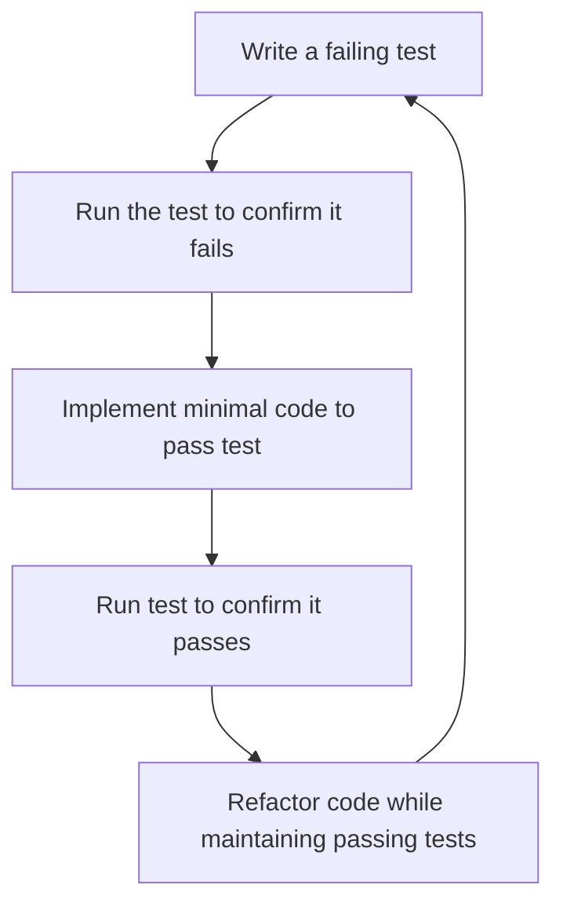

# Testing Workflow

## Overview

This guide outlines the recommended workflow for writing and running tests in the BootHillGM project. Following a consistent testing workflow helps maintain code quality and prevents regressions.

## Test-Driven Development Workflow

For new features or components, we recommend a test-driven development (TDD) approach:

1. **Write Test First**: Start by writing a failing test that defines the expected behavior
2. **Implement Functionality**: Write the minimal code needed to make the test pass
3. **Refactor**: Clean up the implementation while keeping tests passing
4. **Repeat**: Continue the cycle for additional functionality

### Example TDD Workflow



## Day-to-Day Testing Workflow

When working on existing features:

1. **Run Tests**: Start by running the existing tests to ensure everything works
2. **Make Changes**: Implement your changes or fixes
3. **Update Tests**: Modify existing tests or add new tests as needed
4. **Verify**: Run tests again to confirm everything still works
5. **Review**: Review test coverage and add additional tests if needed

## Component Testing Workflow

For component development, follow this workflow:

1. **Define Requirements**: Clearly define what the component should do
2. **Create Test File**: Create a new test file in the appropriate location
3. **Write Basic Tests**: Start with basic rendering and prop tests
4. **Implement Component**: Build the component to satisfy the tests
5. **Add Interaction Tests**: Test user interactions like clicks and form inputs
6. **Add Edge Cases**: Test edge cases and error states
7. **Add Snapshot**: Add a snapshot test if UI consistency is important
8. **Check Coverage**: Ensure all code paths are tested

### Example Component Test Implementation

```typescript
// 1. Import dependencies
import { render, screen, fireEvent } from '@testing-library/react';
import FilterButton from '../../components/FilterButton';

// 2. Create test suite
describe('FilterButton component', () => {
  // 3. Test basic rendering
  it('renders with default props', () => {
    render(<FilterButton label="All" />);
    expect(screen.getByText('All')).toBeInTheDocument();
  });

  // 4. Test interactions
  it('calls onClick handler when clicked', () => {
    const handleClick = jest.fn();
    render(<FilterButton label="All" onClick={handleClick} />);
    
    fireEvent.click(screen.getByText('All'));
    expect(handleClick).toHaveBeenCalledTimes(1);
  });

  // 5. Test active state
  it('has active class when isActive is true', () => {
    render(<FilterButton label="All" isActive={true} />);
    expect(screen.getByText('All').closest('button')).toHaveClass('active');
  });

  // 6. Test disabled state
  it('is disabled when disabled prop is true', () => {
    render(<FilterButton label="All" disabled={true} />);
    expect(screen.getByText('All').closest('button')).toBeDisabled();
  });
});
```

## Hook Testing Workflow

For custom hooks, follow this workflow:

1. **Define Hook Interface**: Determine the inputs and outputs of your hook
2. **Create Test File**: Create a new test file in the hooks test directory
3. **Test Initial State**: Test the hook's initial state
4. **Test State Changes**: Test how the hook responds to changes
5. **Test Edge Cases**: Test edge cases like invalid inputs or boundary conditions
6. **Test Cleanup**: Test that the hook properly cleans up resources

### Example Hook Test Implementation

```typescript
// 1. Import dependencies
import { renderHook, act } from '@testing-library/react';
import { useCounter } from '../../hooks/useCounter';

// 2. Create test suite
describe('useCounter hook', () => {
  // 3. Test initial state
  it('initializes with default value', () => {
    const { result } = renderHook(() => useCounter());
    expect(result.current.count).toBe(0);
  });

  // 4. Test state changes
  it('increments count', () => {
    const { result } = renderHook(() => useCounter(5));
    
    act(() => {
      result.current.increment();
    });
    
    expect(result.current.count).toBe(6);
  });

  // 5. Test boundary conditions
  it('does not decrement below minimum value', () => {
    const { result } = renderHook(() => useCounter(0, { min: 0 }));
    
    act(() => {
      result.current.decrement();
    });
    
    expect(result.current.count).toBe(0);
  });

  // 6. Test cleanup (for hooks that need cleanup)
  it('cleans up event listeners on unmount', () => {
    const removeEventListener = jest.spyOn(window, 'removeEventListener');
    
    const { unmount } = renderHook(() => useEventListener('click', jest.fn()));
    unmount();
    
    expect(removeEventListener).toHaveBeenCalled();
  });
});
```

## Integration Testing Workflow

For integration tests, follow this workflow:

1. **Identify Integration Points**: Determine which components or systems need to be tested together
2. **Set Up Test Environment**: Set up necessary providers and mocks
3. **Define Test Scenarios**: Create realistic user flow scenarios
4. **Implement Tests**: Write tests that simulate user interaction across components
5. **Test Error Handling**: Verify that errors are handled correctly between components
6. **Verify State Changes**: Check that state is correctly shared between components

### Example Integration Test Implementation

```typescript
// 1. Import dependencies
import { render, screen, fireEvent } from '@testing-library/react';
import { GameProvider } from '../../context/GameContext';
import { InventoryPanel } from '../../components/InventoryPanel';
import { CharacterStats } from '../../components/CharacterStats';

// 2. Create test suite
describe('Inventory and Stats Integration', () => {
  // 3. Set up test renderer with necessary context
  const renderWithContext = () => {
    return render(
      <GameProvider>
        <div>
          <CharacterStats />
          <InventoryPanel />
        </div>
      </GameProvider>
    );
  };

  // 4. Test component interaction
  it('equipping weapon updates character stats', () => {
    renderWithContext();
    
    // 5. Initial state check
    expect(screen.getByTestId('stat-strength')).toHaveTextContent('5');
    
    // 6. Simulate user interaction
    fireEvent.click(screen.getByTestId('inventory-item-rusty-sword'));
    fireEvent.click(screen.getByText('Equip'));
    
    // 7. Verify state changes
    expect(screen.getByTestId('stat-strength')).toHaveTextContent('7');
  });
});
```

## Test Review Checklist

Before submitting code for review, check these points:

- [ ] All tests pass
- [ ] New functionality is adequately tested
- [ ] Tests are focused and independent
- [ ] Edge cases and error states are tested
- [ ] No test data is hardcoded (use fixtures instead)
- [ ] Test names clearly describe what they're testing
- [ ] Tests follow project naming conventions
- [ ] No unnecessary console.log statements
- [ ] Test coverage meets project standards

## Debug Workflow for Failed Tests

When a test fails, follow this workflow:

1. **Read Error Message**: Understand what failed and why
2. **Isolate the Test**: Run only the failing test with `it.only()` or `describe.only()`
3. **Add Debug Statements**: Use `screen.debug()` to see the rendered DOM
4. **Check Assumptions**: Verify that your test assumptions are correct
5. **Fix the Issue**: Fix either the test or the code as appropriate
6. **Remove Debug Aids**: Clean up any temporary debug code
7. **Run All Tests**: Ensure all tests pass after your changes

### Example Debugging Process

```typescript
// 1. Isolate the test
it.only('shows validation error for invalid input', async () => {
  render(<FormComponent />);
  
  // 2. Add debug statement to see initial DOM
  screen.debug();
  
  // 3. Interact with component
  fireEvent.change(screen.getByLabelText(/name/i), { target: { value: 'a' } });
  fireEvent.click(screen.getByText(/submit/i));
  
  // 4. Debug after interaction
  screen.debug();
  
  // 5. Check specific elements
  console.log('Error elements:', screen.queryAllByRole('alert'));
  
  // 6. Run assertion
  await waitFor(() => {
    expect(screen.getByText(/name must be at least 3 characters/i)).toBeInTheDocument();
  });
});
```

## Snapshot Testing Workflow

For snapshot tests, follow this workflow:

1. **Create Component**: Implement the component you want to test
2. **Create Snapshot Test**: Create a new test file with `.snap.test.tsx` extension
3. **Generate Initial Snapshot**: Run the test to generate the initial snapshot
4. **Review Snapshot**: Check that the generated snapshot matches expectations
5. **Update After Changes**: Update snapshots when component changes are intentional

### Updating Snapshots

When you intentionally change a component's appearance:

```bash
# Update all snapshots
npm test -- -u

# Update specific component snapshots
npm test -- -u CharacterCard

# Interactive update
npm test -- --watch
# Then press 'u' to update snapshots
```

## Testing Iteration Workflow

As your component evolves, follow this workflow:

1. **Run Tests**: Start by running tests to establish baseline
2. **Make Small Changes**: Make small, focused changes to your code
3. **Update Tests**: Update tests to reflect new behavior
4. **Run Tests Again**: Verify changes work as expected
5. **Refactor**: Clean up code and tests
6. **Repeat**: Continue the process

## Related Documentation

- [[component-testing|Component Testing]]
- [[hook-testing|Hook Testing]]
- [[integration-testing|Integration Testing]]
- [[snapshot-testing|Snapshot Testing]]
- [[test-organization|Test Organization]]
- [[testing-guide|Testing Guide Overview]]
